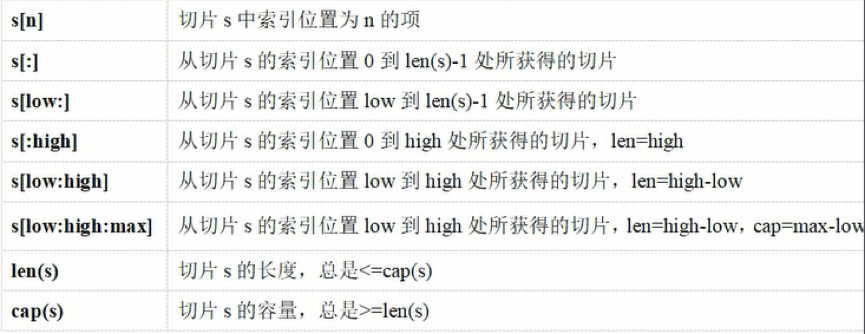
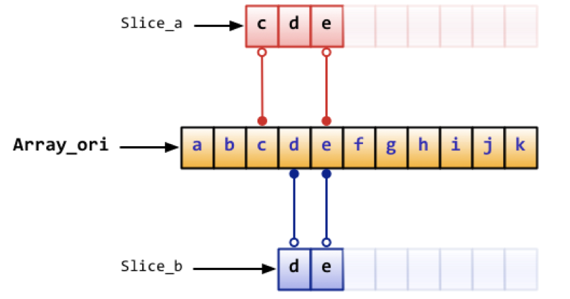

## 一 切片

#### 1.1 切片介绍

在很多应用场景中，数组并不能满足我们的需求。在初始定义数组时，我们并不知道需要多大的数组，因此我们就需要“动态数组”。在Go里面这种数据结构叫slice。
切片解决了数组长度不能扩展，以及基本类型数组传递时产生副本的问题。

#### 1.2 切片创建

常用创建方式：
```go
	var s1 []int				//和声明数组一样，只是没有长度，但是这样做没有意义，因为底层的数组指针为nil
	s2 := []byte {'a','b','c'}
	fmt.Println(s1)				//输出 []
	fmt.Print(s2)				//输出 [97 98 99]
```

从数组创建：slice可以从一个数组再次声明。slice通过array[i:j]来获取，其中i是数组的开始位置，j是结束位置，但不包含array[j]，它的长度是j-i。
```go
	// 声明一个含有10个元素元素类型为byte的数组
	var arr = [10]byte {'a', 'b', 'c', 'd', 'e', 'f', 'g', 'h', 'i', 'j'}

	// 声明两个含有byte的slice
	var a, b []byte

	// a指向数组的第3个元素开始，并到第五个元素结束，
	a = arr[2:5]			//现在a含有的元素: ar[2]、ar[3]和ar[4]
	// b是数组arr的另一个slicre
	b = arr[3:5]			// b的元素是：ar[3]和ar[4]
```
注意：声明数组时，方括号内写明了数组的长度或使用...自动计算长度，而声明slice时，方括号内没有任何字符。  

从切片创建：
```go
oldSlice := []int{1,2,3}
newSlice := oldSlice[:6]	//基于切片前6个元素创建，没有的默认0
```
注意：如果选择的旧切片长度超出了旧切片的cap()值（切片存储长度），则不合法。  

使用make函数创建：
```go
	slice1 := make([]int,5)		//	创建初始值为0，个数为5的切片
	slice2 := make([]int,5,10)	//创建初始值为10，个数为5的切片
	slice3 := []int{1,2,3,4,5}	//创建并初始化
```

#### 1.3 切片内置函数

切片常用内置函数：
- len()			返回切片产后度
- cap()			返回切片底层数组容量
- append()		对切片追加元素
- copy()		复制一个切片

与数组相比，切片多了一个存储能力值的概念，即元素个数与分配空间可以是两个不同的值。合理设置存储能力，可以大幅提升性能，比如知道最多元素个数为50，那么提前设置为50，而不是先设为30，可以明显减少重新分配内存的操作。  

切片空间与元素个数：
```
	slice1 := make([]int, 5, 10)

	fmt.Println(len(slice1))			// 5
	fmt.Println(cap(slice1))			// 10
	fmt.Println(slice1)					// [0 0 0 0 0]
```

切片操作
```
	//切片增加
	slice1 = append(slice1,1,2)
	fmt.Println(slice1)						//输出[0 0 0 0 0 1 2]

	//切片增加一个新切片
	sliceTemp := make([]int,3)
	slice1 = append(slice1,sliceTemp...)
	fmt.Println(slice1)						//输出[0 0 0 0 0 1 2 0 0 0]

	//切片拷贝
	s1 := []int{1,3,6,9}
	s2 := make([]int, 10)	//必须给与充足的空间
	num := copy(s2, s1)

	fmt.Println(s1)			//[1 3 6 9]
	fmt.Println(s2)			//[1 3 6 9 0 0 0 0 0 0]
	fmt.Println(num)		//4

	//切片中删除元素
	s1 := []int{1,3,6,9}
	index := 2					//删除该位置元素
	s1 = append(s1[:index], s1[index+1:]...)
	fmt.Println(s1)				//[1 3 9]

```
注意：没有...会编译错误，默认第二个参数后是元素值，传入切片需要展开。如果追加的长度超过当前已分配的存储空间，切片会自动分配更大的内存。  

#### 1.4 切片的一些简便操作  

slice有一些简便的操作
slice的默认开始位置是0，ar[:n]等价于ar[0:n]
slice的第二个序列默认是数组的长度，ar[n:]等价于ar[n:len(ar)]
如果从一个数组里面直接获取slice，可以这样ar[:]，因为默认第一个序列是0，第二个是数组的长度，即等价于ar[0:len(ar)]
切片的遍历可以使用for循环，也可以使用range函数  

```
// 声明一个数组
var array = [10]byte{'a', 'b', 'c', 'd', 'e', 'f', 'g', 'h', 'i', 'j'}
// 声明两个slice
var aSlice, bSlice []byte

// 演示一些简便操作
aSlice = array[:3] // 等价于aSlice = array[0:3] aSlice包含元素: a,b,c
aSlice = array[5:] // 等价于aSlice = array[5:10] aSlice包含元素: f,g,h,i,j
aSlice = array[:] // 等价于aSlice = array[0:10] 这样aSlice包含了全部的元素

// 从slice中获取slice
aSlice = array[3:7] // aSlice包含元素: d,e,f,g，len=4，cap=7
bSlice = aSlice[1:3] // bSlice 包含aSlice[1], aSlice[2] 也就是含有: e,f
bSlice = aSlice[:3] // bSlice 包含 aSlice[0], aSlice[1], aSlice[2] 也就是含有: d,e,f
bSlice = aSlice[0:5] // 对slice的slice可以在cap范围内扩展，此时bSlice包含：d,e,f,g,h
bSlice = aSlice[:] // bSlice包含所有aSlice的元素: d,e,f,g

```  

#### 1.5 切片的拷贝  

```
s1 := []int{1,2,3,4,5}
s2 := []int{1,2,3}
copy(s1,s2) //复制s1前三个元素到slice2
copy(s2,s1) //复制s23的个元素到slice1前3位置
```  

#### 1.6 切片的截取

  

#### 1.7 字符串转切片  

```
	str := "hello,世界"
	a := []byte(str)		//字符串转换为[]byte类型切片
	b := []rune(str)		//字符串转换为[]rune类型切片
```

#### 1.8 切片存储结构  

切片其实是一个维护了多份数据的结构：
```
type slice struct {
	arrat=y unsafe.Pointer		//指向底层数组的指针
	len int						//切片元素数量
	cap int						//底层数组的容量
}
```
所以切片通过内部的指针和相关属性引用数组片段，实现了变长方案，Slice并不是真正意义上的动态数组，而是一个引用类型，slice总是指向一个底层的array。那么slice的声明也可以像数组一样，只是不需要长度。

