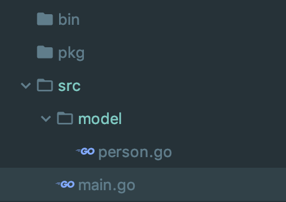

## 一 面向对象三大特性

#### 1.1 封装

封装就是把抽象出的字段和对字段的操作封装在一起,数据被保护在内部,程序的其它包只有通过被授权的操作(方法),才能对字段进行操作。我们可以通过方法或者包对结构体中的属性进行封装。  
通过封装，可以：
- 隐藏实现细节
- 可以对数据进行验证，保证安全合理
封装的实现步骤：
```
1   将结构体、字段(属性)的首字母小写(私有化)；
2   给结构体所在包提供一个工厂模式的函数，首字母大写，类似一个构造函数；
3   提供一个首字母大写的 Set 方法(类似其它语言的 public)，用于对属性判断并赋值：
    func (var 结构体类型名) SetXxx(参数列表) (返回值列表) {
        //加入数据验证的业务逻辑
        var.字段 = 参数 
    }
1) 提供一个首字母大写的 Get 方法(类似其它语言的 public)，用于获取属性的值：
    func (var 结构体类型名) GetXxx() {
        return var.age
    }
特别说明:在 Golang 开发中并没有特别强调封装，这点并不像 Java. 所以提醒学过 java 的朋友， 不用总是用 java 的语法特性来看待 Golang, Golang 本身对面向对象的特性做了简化的.
```
示例：

```go
//person.go
package model

import "fmt"

type person struct {
	Name string
	age int			//年龄是隐私，不允许其他包访问
}

//工厂函数（类似构造函数）
func Person(name string) *person {
	return &person{
		Name: name,
	}
}

func (p *person) SetAge(age int) {
	if age > 0 && age < 150 {		//校验
		p.age = age
	} else {
		fmt.Println("年龄不合法")
	}
}

func (p *person) GetAge() int {
	return p.age
}

//main.go
package main

import (
	"./model"
	"fmt"
)

func main() {
	p := model.Person("Tom")
	p.SetAge(18)
	fmt.Println(p)
}
```

#### 1.2 继承

在 Golang 中，如果一个 struct 嵌套了另一个匿名结构体，那么这个结构体可以直接访 问匿名结构体的字段和方法，从而实现了继承特性。
```go
package main

import (
	"fmt"
)

type Father struct {
	Name string
	age int
}
func (f *Father) run() {
	fmt.Println(f.Name + " like running...")
}

type Son struct {
	Father              //嵌套匿名结构体
}

func main() {

	var s Son

	//s.Father.Name = "Tom"
	//s.Father.age = 10     		//可以访问未导出属性
	//s.Father.run()          	//可以访问未导出方法

	//上述可以简写为：
	s.Name = "Tom"
	s.age = 10
	s.run()

}
```
注意：
- 当结构体和匿名结构体有相同的字段或者方法时，编译器采用就近访问原则访问，如希望访问 匿名结构体的字段和方法，可以通过匿名结构体名来区分。
- 结构体嵌入两个(或多个)匿名结构体，如两个匿名结构体有相同的字段和方法(同时结构体本身 没有同名的字段和方法)，在访问时，就必须明确指定匿名结构体名字，否则编译报错。
- 如果一个 struct 嵌套了一个有名结构体，这种模式就是组合，如果是组合关系，那么在访问组合的结构体的字段或方法时，必须带上结构体的名字。  
关于多重继承：
如果一个 struct 嵌套了多个匿名结构体，那么该结构体可以直接访问嵌套的匿名结构体的字段和方法，从而实现了多重继承。
```go
package main

import (
	"fmt"
)

type Father1 struct {
	Name string
	age int
}
func (f *Father1) run() {
	fmt.Println(f.Name + " like running...")
}

type Father2 struct {
	Like string
}


type Son1 struct {
	Father1
	Father2
}

type Son2 struct {
	*Father1
	*Father2
}

func main() {

	s1 := Son1 {
		Father1{
			Name: "Tom",
			age: 10,
		},
		Father2{
			Like: "伏特加",
		},
	}

	fmt.Println(s1)

	s2 := Son2{
		&Father1{
			Name: "Tom",
			age: 10,
		},
		&Father2{
		 	Like: "伏特加",
		},
	}
	fmt.Println(*s2.Father1)

}
```
如嵌入的匿名结构体有相同的字段名或者方法名，则在访问时，需要通过匿名结构体类型名来
区分。为了保证代码的简洁性，建议大家尽量不使用多重继承。

#### 1.3 多态

多态与接口（interface）有关联，参见下一章节

