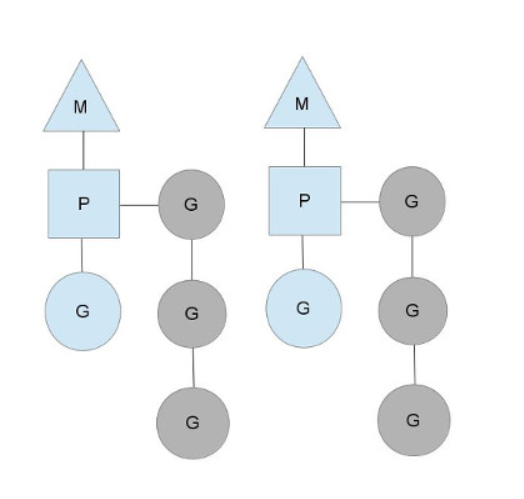

## 一 Golang对协程的支持

Go直接从语言层面支持了并发，goroutine是Go并行设计的核心。goroutine说到底其实就是协程，但是它比线程更小，十几个goroutine可能体现在底层就是五六个线程，Go语言内部帮你实现了这些goroutine之间的内存共享。执行goroutine只需极少的栈内存(大概是4~5KB)，当然会根据相应的数据伸缩。也正因为如此，可同时运行成千上万个并发任务。goroutine比thread更易用、更高效、更轻便。goroutine是通过Go的runtime管理的一个线程管理器。goroutine通过`go`关键字实现了，其实就是一个普通的函数。  

```Go
func say(s string) {
	for i := 0; i < 5; i++ {
		runtime.Gosched()
		fmt.Println(s)
	}
}

func main() {						//Go程序在启动时，就会为main函数创建一个默认的goroutine。 
	go say("world") 				//开一个新的goroutine执行，每个goroutine对应一个哈数
	say("hello") 					//当前goroutine执行
}

// 以上程序执行后将输出：
// hello
// world
// hello
// world
// hello
// world
// hello
// world
// hello

```
> runtime.Gosched()表示让CPU把时间片让给别人,下次某个时候继续恢复执行该goroutine。
> 默认情况下，在Go 1.5将标识并发系统线程个数的runtime.GOMAXPROCS的初始值由1改为了运行环境的CPU核数。
但在Go 1.5以前调度器仅使用单线程，也就是说只实现了并发。想要发挥多核处理器的并行，需要在我们的程序中显式调用 runtime.GOMAXPROCS(n) 告诉调度器同时使用多个线程。GOMAXPROCS 设置了同时运行逻辑代码的系统线程的最大数量，并返回之前的设置。如果n < 1，不会改变当前设置。  
Go协程的特点：
- 有独立的栈空间
- 共享程序堆空间
- 调度由用户控制
- 协程是轻量级的线程
注意：如果主线程退出了，则协程及时还没有执行完毕也退出  

## 二 并发模型  

#### 2.1 常见并发模型
 
在工程上，有两种常见并发模型：共享数据和消息。共享数据最常见的是共享内存。
多线程共享内存：
线程加共享内存的方式归纳为 共享内存系统。线程间共享状态的各种操作都被封装在线程之间的传递消息中。这就需要：发送消息时，对状态进行复制，并且在消息传递的边界上交出这个状态的所有权。由于复制的存在，造成了性能问题。
Go使用消息机制而非共享内存作为通信方式。消息机制认为每个并发单元是自包含的、独立的个体，都有自己的变量，在不同并发单元间不共享，不同单元间输入输出只有消息，类似于进程间互不打扰。Go的这个使用方式称为channel。

#### 2.2 goroutine调度模型

goroutine的概念类似于线程，但goroutine由Go程序运行时的调度和管理。 Go程序会智能地将goroutine中 的任务合理地分配给每个CPU。  

MPG模式运行状态1：

- M:操作系统的主线程（是物理线程），P:协程执行时需要的上下文，G：协程
- 上图中，当前程序有三个物理线程，如果三个物理线程都在同一个CPU运行，就是并发，否则是并行。
- Go的协程是轻量的逻辑态的，Java的多线程是重量的内核态的，几千个线程可能会耗光CPU

这套调度器的工作原理类似于操作系统调度线程， Go程序调度器可以高效地将 CPU资源分配给每一个任务。 传统逻辑中 ， 开发者需要维护线程池中线程与 CPU 核心数量的对应关系。同样 的， Go 地中 也可以通过 runtime.GOMAXPROCS()函数做到。  


在Go1.5之后，程序默认运行在多核上，无需设置，1.5之前需要如下设置：
```go
package main

import (
	"runtime"
	"fmt"
	"time"
)


func main() {

	cpuNum := runtime.NumCPU()			//获取当前系统的CPU核心数

	count := 0

	fmt.Println("CPU数：", cpuNum)

	runtime.GOMAXPROCS(4)				//Go中可以轻松控制使用核心数

	for i := 0; i < 10; i++ {
		go func(){
			for {
				count++
			}
		}()
	}

	time.Sleep(time.Hour)

}
```

runtime.GOMAXPROCS(4)的数值：
- 小于1，不修改任何数值
- =1，单核心执行
- 大于1，多核并发执行
- Go1.5之前默认使用单核，1.5之后默认执行：`runtime.GOMAXPROCS(runtime.NumCPU())`

#### 2.3 常用包

runtime.Gosched():用于让出CPU时间片，让出当前协程的执行权限，调度器安排其他等待的任务运行。（可以理解为接力赛跑：A跑了一段遇到了Gosched接力给B）。  
```Go
func fn (s string) {
	for i := 0; i < 2; i++ {
		fmt.Println(s)
	}
}

func main(){

	go fn("hello")

	for i := 0; i < 2; i++ {
		//runtime.Gosched()
		fmt.Println("world")
	}

}
```

runtime.Goexit():用于立即终止当前协程运行，调度器会确保所有已注册defer延迟调用被执行。  

runtime.GOMAXPROCS():用来设置可以并行计算的CPU核心数最大值，并返回之前的值，Go使用该函数实现了并行执行。

#### 2.4 Go语言的协作程序 Cgo「outine)和普通的协作程序 Ccoroutine)

C#、 Lua、 Python语言都支持 coroutine特性。 coroutine与 goroutine在名字上类似， . 都可以将函数或者语旬在独立的环境中运行，但是它们之间有两点不同:
- goroutine可能发生并行执行;但coroutine始终顺序执行。

狭义地说， goroutine可能发生在多线程环境下， goroutine无法控制自己获取高优先度 支持; coroutine 始终发生在单线程， coroutine 程序需要主动交出控制权，宿主才能获得控 制权并将控制权交给其他 coroutine。

- goroutine I、可使用 channel 通信; coroutine 使 用 yield 和 resume 操作。

goroutine 和 coroutine 的概念和运行机制都是脱胎于早期的操作系统 。  

coroutine 的运行机制属于协作式任务处理，早期的操作系统要求每一个应用必须遵守操作系统的任务处理规则，应用程序在不需要使用 CPU 时，会主动交出 CPU 使用权。如 果开发者无意间或者故意让应用程序长时间占用 CPU，操作系统也无能为力，表现出来的 效果就是计算机很容易失去响应或者死机。   

goroutine 属于抢占式任务处理，己经和现有的多线程和多进程任务处理非常类似。应 用程序对 CPU 的控制最终还需要由操作系统来管理，操作系统如果发现一个应用程序长 时间大量地占用 CPU，那么用户有权终止这个任务 。

## 三 goroutine使用案例

#### 3.1 同时执行两件事

```go
package main

import (
	"fmt"
	"time"
)

func running() {
	var times int
	for {
		times++
		fmt.Println("tick:", times)
		time.Sleep(time.Second)
	}
}

func main() {

	go running()

	var input string
	fmt.Scanln(&input)

}
```
命令行会不断地输出 tick，同时可以使用 fmt.Scanln()接受用户输入。两个环节可以同时进行，直到按 Enter键时将输入的内容写入 input变量中井返回，
整个程序终止。

## 四 Go中获取协程结果的办法

Go中可以使用全局互斥锁（不推荐）与channel的方式进行协程通信。
