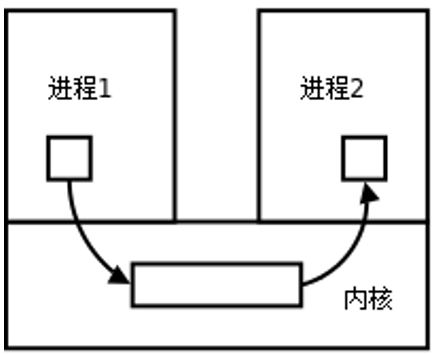
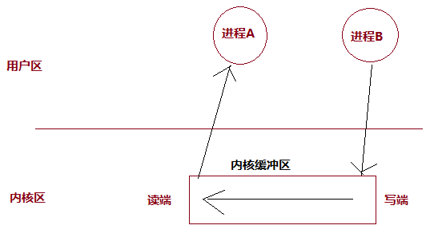
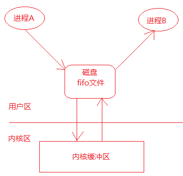
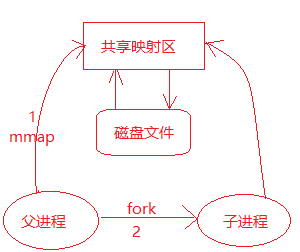

## 一  进程概念

> 进程：就是二进制可执行文件在计算机内存中的运行实例，可以简单理解为：一个.exe文件是个类，进程就是该类new出来的实例。 
> 进程是操作系统最小的资源分配单位（如虚拟内存资源），所有代码都是在进程中执行的。 

为了方便管理进程，每个进程都有自己的描述符，是个复杂的数据结构，我们称之为**进程控制块**，即PCB(Process Control Block)。  

PCB中保存了进程的管理、控制信息等数据，主要包含字段有：
```
进程ID（PID）：进程的唯一标识符 ，是一个非负整数的顺序编号
父进程ID（PPID）：当前进程的父进程ID
文件描述符表：即很多指向file接否提的指针
进程状态：就绪、运行、挂起、停止等状态
虚拟地址范围
访问权限 
当前工作目录
用户id和组id
会话和进程组
``` 

贴士：进程ID是可以重用的，当进程ID达到最大限额值时，内核会从头开始查找闲置的进程ID并使用最先找到的那一个作为新进程的ID

## 二 进程创建

Unix系统在启动后，会首先运行一个名为 init 的进程，其PID 为 1。该进程是所有其他进程的父进程。  

Unix操作系统通过 `fork()` 函数能够创建多个子进程，从而能够提升计算机资源的利用率。此时调用者称为父进程，被创造出来的进程称为子进程。  
- 每个子进程都是源自它的父进程的一个副本，它会获得父进程的数据段、堆、栈的拷贝，并与父进程共享代码段。  
- 子进程对自己副本的修改对其父进程和兄弟进程都是不可见的，反之亦然。  

创建的子进程可以直接开始运行，但是也可以通过 `exec()` 函数来加载一个全新的程序，此时子进程会丢弃现存的程序文本段，为加载的新程序重新创建栈、数据段、堆，我们对这一个过程称为执行一个新程序。  

贴士：exec并不是1个函数, 是一系列 exec 开头的函数，作用都是执行新程序。 

C语言示例如下：
```c
#include <stdio.h> 
#include <stdlib.h>
#include <unistd.h>
 
int main(){

    pid_t pid;
    int r;

    // 创建子进程
    pid = fork();                     
    if (pid == -1){                   // 发生错误
        perror("fork发生错误 ");
        exit(1);
    }
 
    // 返回值大于0时是父进程
    if(pid > 0){                        
        printf("父进程: pid = %d, ppid = %d \n", getpid(),getppid());        // 父进程执行动作
        sleep(3);                       // 父进程睡眠，防止子进程还没运行完毕，父进程却直接退出了
    }
    
    // 返回值为0的是子进程
    if(pid == 0){   

        printf("子进程: pid = %d , ppid = %d \n", getpid(),getppid());     // 子进程执行动作

        // 子进程加载一个新程序：系统自带的 echo程序，输出 hello world!
        char * execv_str[] = {"echo", "hello world!",NULL};
        int r = execv("/bin/echo", execv_str);    // 笔者的是mac，linux上为： "/usr/bin/echo"  
		if (r <0 ){
			perror("error on exec");
			exit(0);
        }
    }
    return 0; 
}
```

在 Go 语言中，没有直接提供 fork 系统调用的封装，而是将 fork 和 execve 合二为一，具体信息可以参见Go的os包。

```go
package main

import (
	"fmt"
	"os"
	"time"
)

func main() {

	fmt.Println("当前进程ID：", os.Getpid())

	procAttr := &os.ProcAttr{
		Files: []*os.File{os.Stdin, os.Stdout, os.Stderr},
	}
	process, err := os.StartProcess("/bin/echo", []string{"", "hello,world!"}, procAttr)
	if err != nil {
		fmt.Println("进程启动失败:", err)
		os.Exit(2)
	} else {
		fmt.Println("子进程ID：", process.Pid)
	}

	time.Sleep(time.Second)

}
```
根据该方式，就可以很容运行计算机上的其他任何程序，包括自身的命令行、Java程序等等。 


## 四 进程分类

进程分类：
- 用户进程：位于用户空间中，是程序执行的实例
- 内核进程：位于内核空间中，可以访问硬件

由于用户进程无法访问内核空间，所以无法直接操作硬件。内核会暴露一些接口提供给用户进程使用，让用户进程简介操作硬件，这便是系统调用。  

内核为了保证系统的安全和稳定，为**CPU**特供了两个状态：
- 用户态：大部分时间CPU处于该状态，此时只能访问用户空间
- 内核态：当用户进程发起系统调用时，内核会将CPU切换到内核态，然后执行相应接口函数。

注意：这里的用户态和内核态是针对CPU的。

## 五 进程调度

同一时刻只能运行一个进程，但是CPU可以在多个进程间进行来回切换，我们称之为上下文切换。  

操作系统会按照调度算法为每个进程分配一定的CPU运行时间，称之为时间轮片，每个进程在运行时都会认为自己独占了CPU，如图所示：  



切换进程是有代价的，因为必须保存进程的运行时状态。

## 六 进程状态转换

进程在创建后，在执行过程中，其状态一直在变化。不同时代的操作系统有不同的进程模型：
- 三态模型：运行态、就绪态、等待态
- 五态模型：初始态、就绪态、运行态、挂起态（阻塞）、终止态

本笔记介绍五态模型。初始态是进程的准备节点，常与就绪状态结合来看，进程的状态转换图：  



## 七 进程运行的问题

### 7.1 写时复制

父进程无法预测子进程什么时候结束，只有进程完成工作后，父进程才会调用子进程的终止态。  

贴士：全盘复制父进程的数据相当低效，Linux使用写时复制（COW：Copy on Write）技术来提高进程的创建效率。  

### 7.2 进程回收

当一个进程退出之后，进程能够回收自己的用户区的资源，但是不能回收内核空间的PCB资源，必须由它的父进程调用wait或者waitpid函数完成对子进程的回收，避免造成系统资源的浪费。  

> 孤儿进程：父进程先于子进程结束，则子进程成为孤儿进程，此时该进程会被系统的 init 进程领养 

> 僵尸进程：子进程终止，但父进程未回收，子进程残留资源（PCB）于内核中，变成僵尸进程。  

注意：由于僵尸进程是一个已经死亡的进程，所以不能使用kill命令将其杀死，通过杀死其父进程的方法可以消除僵尸进程，杀死其父进程后，这个僵尸进程会被init进程领养，由init进程完成对僵尸进程的回收。

## 八 进程间通信

### 8.0 进程间通信方式概述

Linux环境下，进程地址空间相互独立，每个进程各自有不同的用户地址空间。任何一个进程的全局变量在另一个进程中都看不到，所以进程和进程之间不能相互访问，要交换数据必须通过内核，在内核中开辟一块缓冲区，进程1把数据从用户空间拷到内核缓冲区，进程2再从内核缓冲区把数据读走，内核提供的这种机制称为进程间通信（IPC，InterProcess Communication）。   

  

在进程间完成数据传递需要借助操作系统提供特殊的方法，如：文件、管道、信号、共享内存、消息队列、套接字、命名管道等。随着计算机的蓬勃发展，一些方法由于自身设计缺陷被淘汰或者弃用。现今常用的进程间通信方式有：
- 管道 (使用最简单)
- 共享映射区 (无血缘关系进程通信)
- 信号 (开销最小)
- 本地套接字 (最稳定)

Go支持的IPC方法有：管道、信号、socket。  

### 8.1 管道  

管道是一种最基本的IPC机制，也称匿名管道，应用于有血缘关系的进程之间，完成数据传递。调用C的pipe函数即可创建一个管道。  

  

管道有如下特质：
- 管道的本质是一块内核缓冲区 
- 由两个文件描述符引用，一个表示读端，一个表示写端。
- 规定数据从管道的写端流入管道，从读端流出。
- 当两个进程都终结的时候，管道也自动消失。
- 管道的读端和写端默认都是阻塞的。

管道的实质是内核缓冲区，内部使用唤醒队列实现。  

管道的缺陷：
- 管道中的数据一旦被读走，便不在管道中存在，不可反复读取。
- 数据只能在一个方向上流动，若要实现双向流动，必须使用两个管道
- 只能在有血缘关系的进程间使用管道。

Go模拟管道的实现：
```go
	cmd1 := exec.Command("ps", "aux")
	cmd2 := exec.Command("grep", "apipe")

	var outputBuf1 bytes.Buffer
	cmd1.Stdout = &outputBuf1
	cmd1.Start()
	cmd1.Wait()				// 开始阻塞

	var outputBuf2 bytes.Buffer
	cmd2.Stdout = &outputBuf2
	cmd2.Start()
	cmd2.Wait()				// 开始阻塞

	fmt.Println(outputBuf2.Bytes())
```

当然也有一种管道称为命名管道（FIFO），它支持无血缘关系的进程之间通信。FIFO是Linux基础文件类型中的一种（文件类型为p，可通过ls -l查看文件类型）。但FIFO文件在磁盘上没有数据块，文件大小为0，仅仅用来标识内核中一条通道。进程可以打开这个文件进行read/write，实际上是在读写内核缓冲区，这样就实现了进程间通信，如图所示：  

  

### 8.2 内存映射区

存储映射I/O (Memory-mapped I/O) 使一个磁盘文件与存储空间中的一个缓冲区相映射。从缓冲区中取数据，就相当于读文件中的相应字节；将数据写入缓冲区，则会将数据写入文件。这样，就可在不使用read和write函数的情况下，使用地址（指针）完成I/O操作。  

使用存储映射这种方法，首先应通知内核，将一个指定文件映射到存储区域中。这个映射工作可以通过mmap函数来实现。  

  

### 8.3 信号

信号是IPC中唯一一种异步的通信方法，本质是用软件模拟硬件的中断机制，例如：在命令行终端按下某些快捷键，就会挂起或停止正在运行的程序。Go中的ginal包提供了相关操作。  

```go
	sigRecv := make(chan os.Signal, 1)                      // 创建接收通道
	sigs := []os.Signal{syscall.SIGINT, syscall.SIGQUIT}    // 创建信号类型
	signal.Notify(sigRecv, sigs...)
	for sig := range sigRecv {                              // 循环接收通道中的信号，通道关闭后，for会立即停止
		fmt.Println(sig)
	} 
```

### 8.4 socket

socket即套接字，也是一种IPC方法，与其他IPC方法不同之处在于：可以通过网络连接让多个进程建立通信并相互传递数据，这使得通信不再依赖于在同一台计算机上。

## 九 进程同步

当多个子进程对同一资源进行访问时，就会产生竞态条件。比如：某一个数据，进程A对其进行执行`一系列`操作，但是在执行过程中，系统有可能会切换到另外一个进程B中，B也对该数据进行`一系列`操作，那么在两个进程中操作同一份数据时，这个数据的结果值到底按照谁的来运算呢？    

原子操作：如果执行过程中操作不能中断，那么就能解决上述问题，这样的操作称为原子操作（atomic operation）。这些只能被串行化访问或执行的资源或者某段代码被称为临界区（critical section）。Go中(sync/atomic包提供了原子操作函数)。  

注意：
- 所有的系统调用都是原子操作，即不用担心它们的执行被中断！
- 原子操作不能被中断，临界区是否可以被中断没有强制规定，只是保证了只能同时被一个访问者访问。 

问题：如果一个原子操作无法结束，现在也无法中断，如何处理？  
> 答案：内核只提供了针对二进制位和整数的原子操作（即保证细粒度），不会有上述现象。  

互斥锁：  
在实际开发中，原子操作并不通用，我们可以保证只有一个进程/线程在临界区，该做法称为互斥锁（exclusion principle），比如信号量是实现互斥方法的方式之一，Golang的sync包也有对互斥的支持。  