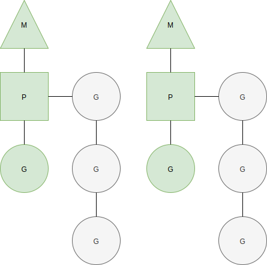

## 一 调度器的调度

#### 1.0 调度器概述

Go线程模型中一部分调度任务由操作系统内核之外的程序承担，即调度器。其调度对象是M、P、G的实例。  

每个M在运行过程中的偶会按需执行一些调度任务。  

MPG模式运行状态：
 

#### 1.1 一轮调度

go程序初始化完毕后，调度器会进行一轮调度(位于runtime中的schedule函数)，以让main函数中的G有机会开始运行。  

一轮调度查找G流程：  
- 1 调度器会先查找全局（调度器的）可运行G队列以及本地P的可运行G队列
- 2 找不到则进入强力查找模式：从任何可以获得G的地方查找G
- 3 还是找不到，则该子流程暂停，直到有可运行的G出现才会继续下去
- 4 子流程结束，意味着当前M抢到了一个可运行的G

调度器找到G后的流程：
- 如果调度器在一轮调度之初发现当前M已经与某个G锁定，会立即停止调度并阻塞当前M，如果G到了可运行状态，M会被唤醒并继续运行G。  
- 如果当前M找到了可运行G，却发现该G与另外的M碎钉，它会唤醒绑定的M来运行该G，并重新为当前M寻找可运行G
- 如果当前M未与任何G锁定(gcwaiting值不为0)，那么停止Go调度器，即STW(Stop the world)并等待运行时串行任务正在执行
- 当锁定和运行时串行任务都为假，执行寻找G。

#### 1.2 强力查找模式

一轮调度器开启强力找子流程时，会多次尝试从任何可以获得G的地方查找G，使用的函数是`runtime.findrunnabel`，返回一个处于`Grunnable`状态的G。  

阶段一执行步骤如下：

- 步骤一：获取终结函数的G。对象在未被任何其他对象引用时（不可达）就会被垃圾回收器回收，回收前会调用函数`runtime.SetFinalizer`将该对象与一个中终结函数绑定。所有的终结函数由一个专用的G负责。调度器如果发现该G完成任务，会将其状态设置为Grunnable并放入本地P的可运行G队列。
- 步骤二：从本地P的可运行G队列获取一个G
- 步骤三：找不到则从调度器的可运行对垒获取G
- 步骤四：找不到则从网络I/O轮询器（netpoller）获取G
- 步骤五：找不到则从其他P的可运行G队列获取G

如果上述步骤还是无法搜索到可用G，那么搜索进入阶段二：
- 步骤一：调度器判断是否处于GC标记节点，如果是，则把本地P持有的GC标记的G状态改为Grunnable并返回结果
- 步骤二：再次从调度器可运行G队列获取G，找不到则解除本地P与当前M关联，并把P放入调度器的空闲P列表
- 步骤三：遍历全局P列表中的P，检查可运行G队列，如果发现某个P的可运行G队列不为空，则取出一个P，关联到当前M，进入阶段一重新执行
- 步骤四：全局P列表也没有可运行G队列，则判断是否正处于GC标记节点，以及相关资源是否可用，如果都是true，调度器会从空闲P列表拿出一个P，如果该P持有一个GC标记专用G，就关联P与M，执行阶段二的步骤一
- 步骤五：继续从I/O轮询器获取G

上述2个阶段都查找不到G，则调度器就会停止当前M。

#### 1.3 M的启动与停止  

在高并发Go程序中，并发量越大，调度器对MPG的调度就越频繁，相应的M的启动和停止也会被执行的更频繁。  

M启动和停止相关的函数有：
- `stopm()`：停止当前M，直到有心的G变得可运行而被唤醒
- `gcstopm()`：停止当前M，为串行运行时任务的执行让路，任务结束后被唤醒
- `stoplockedm()`：停止与G锁定的M的执行，直到这个G变得可运行而被重新唤醒
- `startlockedm(gp *g)`：唤醒与gp锁定的M，并让M执行gp
- `startm(_p_ *p, spining bool)`：唤醒或者创建一个M，然后关联_p_并执行

#### 1.4 系统检测任务

系统检测任务由函数`sysmon`实现，他完成了以下事情：
- 在需要时抢夺符合条件的P和G
- 在需要时进行强制GC
- 在需要时清扫堆
- 在需要时打印调度器跟踪信息

检测任务被包裹在一个循环之中，会被一直执行下去，直到Go程序结束。

## 二 g0和m0

M中拥有两个特殊的元素
- g0：M初始化时运行时生成的线程，所在的栈称为调度栈/系统栈/调度栈/OS线程栈，用于执行调度、垃圾回收、栈管理
- gsignal：处理信号的G，所在的栈称为信号栈
- runtime.g0：用于执行引导程序，位于Go程序第一个内核线程中，该内核线程是runtime.m0

注意：
- g0不会被阻塞，也不会包含在任何G队列或者列表中，其栈也不会再垃圾回收期被扫描
- runtime.m0和runtime.g0都是静态分配的，无需分配内容
- runtime.m0的g0级runtime.g0

## 三 调度器锁和原子操作

每个M都有可能执行调度任务，这些任务的执行在时间上可能会重叠，即并发的调度。因此，调度器会在读写一些全局变量以及它的字段时使用调度器锁进行保护。  

Go运行时系统在一些需要保证并发安全的变量存取上使用了原子操作。原子操作比锁操作清凉很多，可以节约大量资源，比如sched.nmspinning,sched.ngsys等变量读写时都会用到原子操作。

## 四 GC调整

当前Go的GC基于CMS算法，拥有三种执行模式：
- gcBackgroundMode：并发执行垃圾收集（标记）和清扫
- gcForceMode：串行执行垃圾收集（执行时停止调度），但是会并发的执行清扫
- gcForceBlockMode：串行执行垃圾收集和清扫

调度器驱使的自动GC和系统检测任务中的强制GC，都是gcBackgroundMode模式，但是前者会检查内存使用量，只有增量过大时才执行GC，后者无视这个条件。  

通过环境变量GODEBUG可以手动控制GC并发性，设置gcstoptheworld的值为1，GC的执行模式就会由gcBackgroundMode变为gcForceMode，设为2则变为gcForceBlockMode。  

Go运行时系统会在分配新内存是会检查Go程序的内存使用增量，若增量翻倍，则会触发GC。人工设置`runtime/debug.SetGCPercent`函数可以改变增量阈值（int类型，已分配内存的百分之几触发GC）。默认阈值是100，为负数时不会触发GC，该函数在被调用后会返回旧的阈值。  

注意：
- GOGC环境变量也可以设置GC阈值，但是必须在程序启动前进行设置  
- 关闭GC后就需要手动GC，`runtime.GC`函数可以手动触发一次GC，不过这个GC函数会阻塞调用方直到GC完成，此时GC以gcForceBlockMode模式执行
- 调用`runtime/debug`包的`FreeOSMemory`函数也可以手动触发一次串行GC，并在GC完成后执行一次清扫堆操作