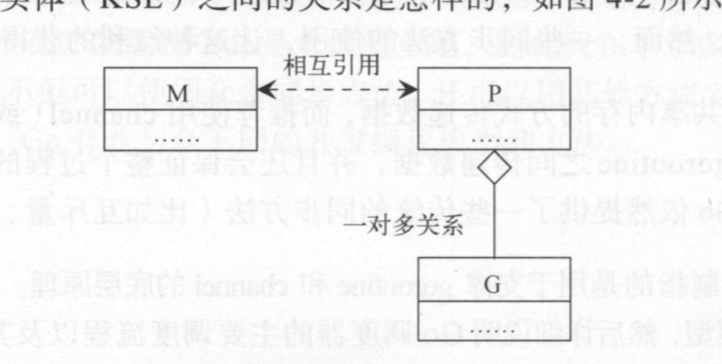
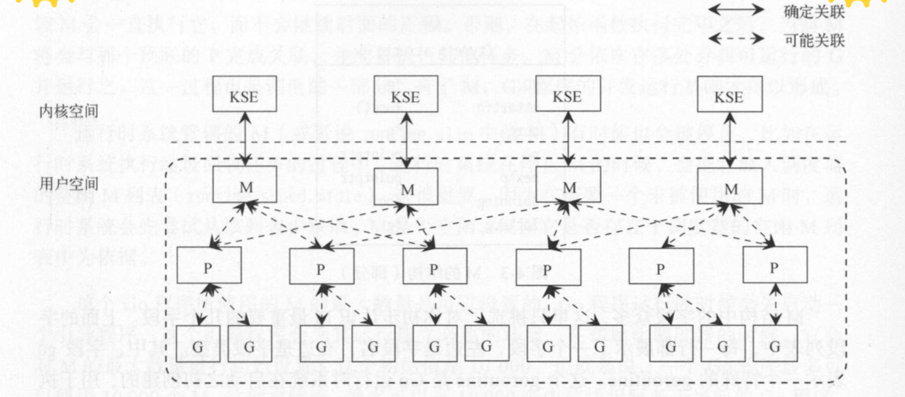
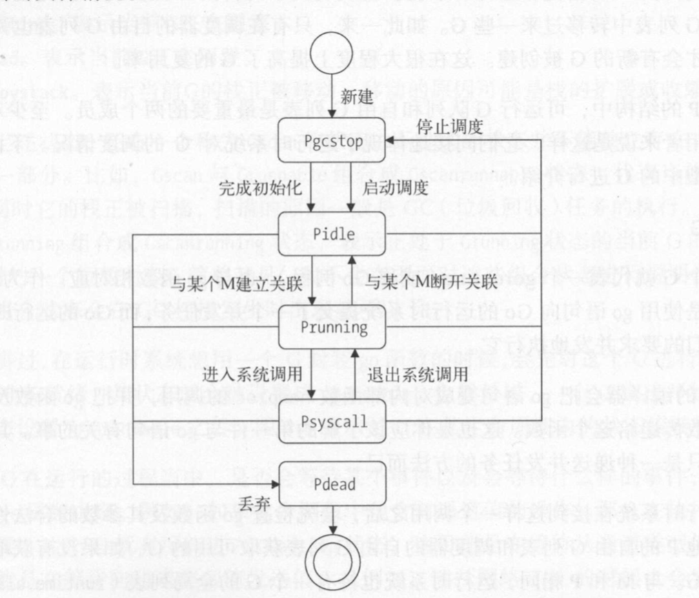
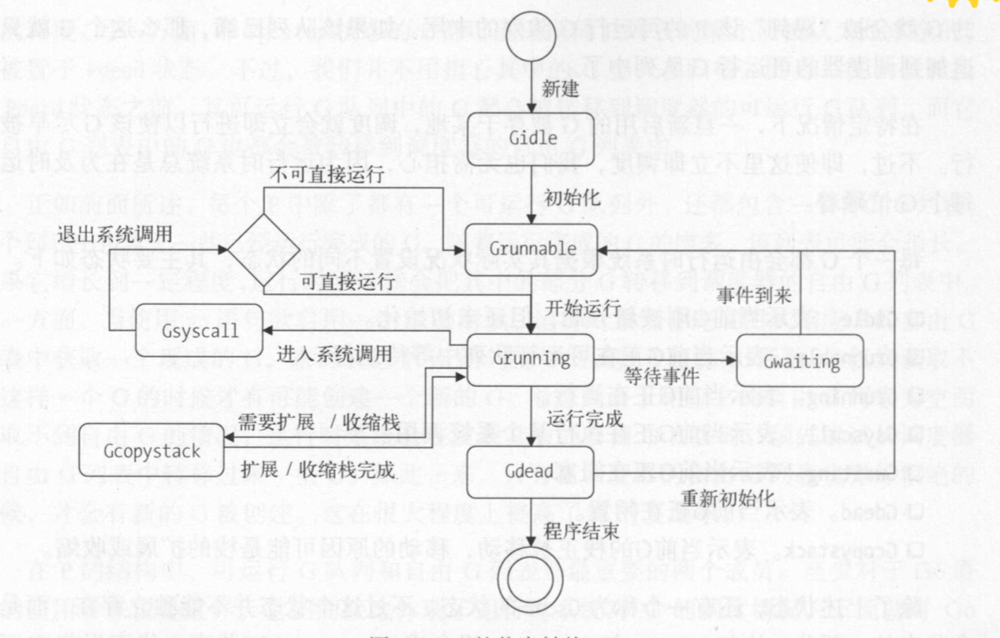

## 一 go通信主张

Go的著名主张：
```
不要用共享内存的方式来通信，应该以通信作为手段来共享内存
```

数据放在共享内存中提供给多个线程访问的方式，虽然思想上简单，但是却使并发访问控制变得复杂，同时，一些同步方法的使用，让多核CPU的优势难以发挥。  

Go推荐使用通道（channel）的方式解决数据传递问题，在多个goroutine之间，channel复杂传递数据，还能保证整个过程的并发安全性。当然Go也依然提供了传统的同步方法，如互斥量，条件变量等。 

## 二 Go线程模型三元素  

Go的线程实现模型有三个元素，即MPG：
- M：machine，一个M代表一个工作线程
- P：processor，一个P代表执行一个Go代码段需要的上下文环境
- G：goroutine，一个G代表一个Go协程

一个G的执行需要P和M的支持，M与P关联后，就会形成一个有效的G运行环境：工作线程+上下文环境。其关系如图所示：  

  

内核调度实体（KSE）负责调度这些工作线程M，每个实体对应一个M。  

 

#### 三 MPG

#### 3.1 M

工作线程M用来关联上下文环境P，如果没有足够的工作线程，则会创建新的M。在一些特殊情况下，也会创建一些工作线程，如：执行系统监控，执行垃圾回收等。   

M常用源码字段如下：
```go
type m struct {
    g0 *g                   // Go运行时启动之初创建，用于执行运行时任务
    mstartfn func()         // M起始函数，即 代码中 go携带的函数
    curg *g                 // 存储当前正在运行的代码段G的指针
    p puintptr              // 指针：当前关联的上下文P
    nextp puintptr          // 指针：与当前M有潜在关联的P，调度器将某个P赋给某个M的nextp，则及时预关联
    spinning bool           // 当前M是否正在寻找可运行的G
    lockedg *g              // 与当前M锁定的G
}
```

M在创建时，会被加入全局的M列表（runtime.allm)，此时起始函数mstartfn会和预关联的P都被设定，最后，运行时为M创建一个新工作线程并与之关联，起始函数只作为系统监控和垃圾回收使用（通过起始函数可以获取M所有信息，也可以防止M被当做垃圾回收掉）。   

当运行时停止M时，M会被放入空闲M列表（runtime.sched.midle)，运行时只会从该列表中回收M。  

Go可以手动设定可以使用的M数量（一个Go程序默认最多可使用10000个M），即：`runtime/debug.SetMaxThreads`(该值越早设定越好)

#### 3.2 P

Go运行时会适时的让上下文环境P与不同的工作线程M建立连接或者断开，以使P中的可运行G即使获得运行时机。    

P的结构包含两个重要成员：
- 可运行G队列：要运行的G列表
- 自由G列表：已完成运行的G列表，可以提高G的复用率

P的数量即是G的队列数量，其最大值用来限制并发运行G的规模，可以在`runtime.GOMAXPROCS`中设置。  

当工作线程M中的运行的G进入了系统调用，运行时将会把M和与之关联的P分离。如果分离后，P的可运行队列中海油未被运行的G，运行时会找到一个空闲的M或者创建新的M，并与该P关联，以满足剩余的G运行需要，所以一般情况下M的舒朗都会比P多。  

运行时中也存在一个调度器的空闲P列表(runtime.sched.pidle)，P不再与M关联时，会被放入该列表（P会被清空可运行G队列），如果运行时需要一个空闲的P与M关联，则从该列表取出一个。  


P是有状态的，如图所示： 
   

非Pdead状态的P都会在运行时要停止调度时被设置为Pgcstop状态，等到要重新调度时，不会被恢复到原有状态，而是统一被转换为Pidle状态，公平接受再次调度。  

自由G列表会随着完成运行的G增多而增大，到一定程度后，运行时会将其中部分G转移到调度器自己的自由G列表中。

#### 3.3 G

一个G代表一个Go协程goroutine，即go函数。go语句会被传递为内部函数newproc的调用。  

在go函数启动一个G时：
- 运行时会先从相应的P的自由G列表获取一个G封装go函数
- 如果P的自由G列表为空，则会先从调度器本身的自由G列表中转移过来一些G到P的自由G列表中
- 如果调度器本身的自由G列表也为空，则新建一个G

运行时本身持有一个G的全局列表（runtime.allgs)，用于存放当前运行时系统中所有G的指针，新建的G会被加入该列表。  

执行步骤：
- 初始化：无论是新G还是取出来的G都会被运行时初始化，包括其关联函数、G状态、ID
- 将初始化后的G存储到本地P的runnext字段中
- 如果runnext字段中已经存在G，则存在的G会被踢到该P可运行G队列的末尾，如果队列已满，则G只能追加到调度器本身的可运行G队列中

每个G都会由运行时根据需要设置为不同的状态：
- Gidle：刚被分配，未初始化
- Grunnabel：正在可运行队列中等待运行
- Grunning：正在运行
- Gsyscall：正在执行某个系统调用
- Gwaiting：G被阻塞中
- Gdead：G闲置中
- Gcopystack：G的栈因为扩展或收缩，正在被移动

G还有一些组合状态Gscan，组合态代表G的栈正在被GC扫描，如：
- Gscanrunnable：G等待运行中，它的栈也被正在扫描（因为垃圾回收）
- Gscanrunning：G运行中，它的栈正在被GC扫描
- ....


G的状态转换图：  
  

注意：
- 进入死亡状态Gdead的G可以重新被初始化
- 但是P进入死亡状态Pdead后只能被销毁

## 四 MPG容器 

MPG容器在上一节已经有所介绍，这里汇总一下：  
   

全局容器只是为了罗列某个核心元素的全部。  

任何G都会存在于全局G列表中，其余的4个容器则只会存放在当前作用于内的，具有每个状态的G。  

调度器的可运行G列表和P的可运行G列表拥有几乎平等的运行机会：
- 刚被初始化的G都会被放入本地P的可运行G队列
- 从Gsyscall状态转出的G都会被放入调度器的可运行G队列
- Gdead状态的G，会被放入本地P的自由G列表

两个可运行G队列会互相转移G：
- 调用runtime.GOMAXPROCS函数，会导致运行时系统把将死的P的可运行G队列中的G全部转移到调度器的可运行G队列
- 如果本地P的可运行G队列已满，则一半的G会被转移到调度器可运行G队列中

