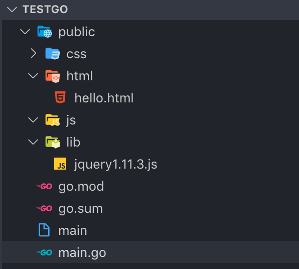

## 一 Hello World

```go
package main

import(
	"fmt"
	"net/http"
)

func helloworld(w http.ResponseWriter, r *http.Request) {
	fmt.Fprintf(w, "hello world!")
}

func main() {

	http.HandleFunc("/hello", helloworld)

	server := http.Server{
		Addr: ":8080",
	}
	server.ListenAndServe()

}
```

访问：`localhost:8080/hello`，页面输出：`hello world!`

## 二 常见功能

#### 2.1 静态文件管理

在helloworld项目的目录中创建文件夹`public`用于存放html静态文件：
```go
    files := http.FileServer(http.Dir("./public"))
    http.Handle("/static/", http.StripPrefix("/static/", files)) 
```

注意：
- 直接使用编辑器运行会造成路径不正确，应该先使用 `go build` 后，运行二进制文件。推荐使用绝对路径：`os.Executable()`获取绝对路径
- 访问类似`http://localhost:8080/static/hello.html`网址，服务端会替换掉static为`public`路径

#### 2.2 参数获取

在helloword案例的整理目录结构如下：  



```go
package main

import(
	"fmt"
    "net/http"
)

func helloworld(w http.ResponseWriter, r *http.Request) {

    // 默认不会解析，需要先解析表单
    err := r.ParseForm()
    if err != nil {
        fmt.Println("参数解析出错：", err)
        return
    }
	
    fmt.Println("path", r.URL.Path)	    // 输出 /
    fmt.Println(r.Form)                 // 输出 map[id:[4] name:[张三]]

	fmt.Fprintf(w, "helloworld")
}

func main() {

    http.HandleFunc("/hello", helloworld)
    
    files := http.FileServer(http.Dir("./public"))
    http.Handle("/static/", http.StripPrefix("/static/", files))

    server := http.Server{
		Addr: ":8080",
    }
	server.ListenAndServe()

}
```
GET和POST方式访问时，参数解析都会得到支持：
- GET方式访问：访问地址为 `localhost:8080/?id=4&name=张三`
- POST方式访问：在hello.html文件中加入如下ajax访问方式
```js
    <script src="../lib/jquery1.11.3.js"></script>
    <script>
        $.ajax({
            type: "POST",
            url: "/hello",
            data: {
                "id": 4,
                "name": "张三",
            },
            success: function (data) {
                console.log("data=",data);
            },
            error: function(err){
                console.log("err=",err);
            }
        })
    </script>
```

#### 2.3 模板引擎

笔者是坚定的前后端分离主义者，这里只是介绍go默认模板引擎的基本使用。   

在Go语言中，使用`template`包来进行模板处理，使用类似`Parse`、`ParseFile`、`Execute`等方法从文件或者字符串加载模板。  

在上述helloworld案例的main函数中添加一个处理函数：
```go
	http.HandleFunc("/testTemplate", testTemplate)
```
处理函数为：
```go
    // 解析模板文件
    t, _ := template.ParseFiles("./views/test.html")
    // 声明一个字符串切片
    stars := []string{"马蓉", "李小璐", "白百何"}
    // 执行模板
    t.Execute(w, stars)
```
创建一个模板文件`views/test.html`：
```html
<body>
     <!-- 嵌入动作 -->
     {{range .}}
     <a href="#">{{.}}</a>
    {{else}}
     没有遍历到任何内容
    {{end}}  
</body>
```

