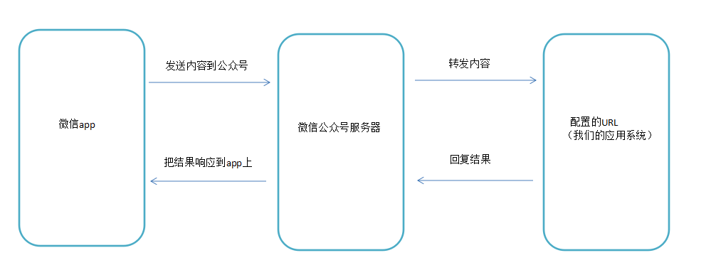
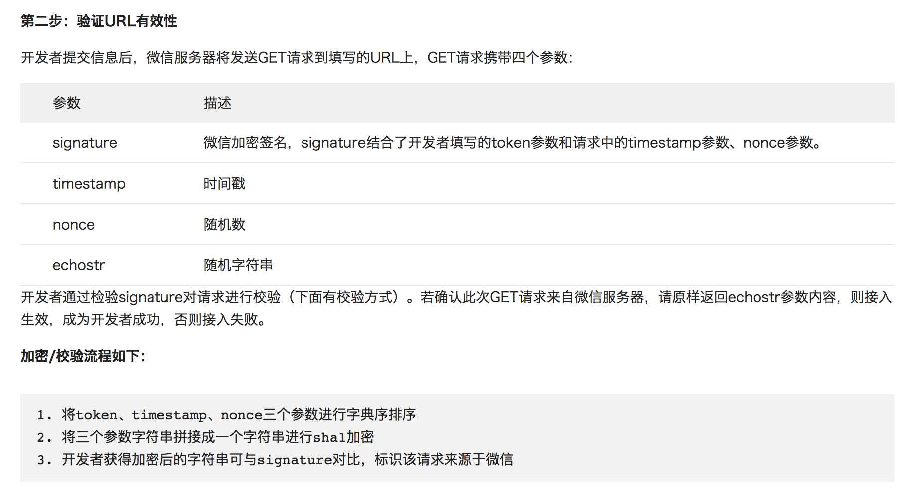

## 一 微信公众号开发概念

#### 1.1 公众号的分类

微信公众号分为四类：
- 订阅号：每天能推送消息，允许个人申请，适合资讯服务（如各种媒体）
- 服务号：每月4次推送，适合企业数据服务交互（如招商银行公众号）
- 企业号：现在叫做企业微信，企业内部办公管理使用（可以理解为叮叮）
- 小程序：小程序功能更多，相当于简易版的app,比常规app开发简单。

#### 1.2 微信公众平台

微信公众平台地址（管理微信公众号相关的后台）：http://mp.weixin.qq.com   

微信公众平台分为两种管理模式：
- 编辑模式：进入公众平台后，左侧默认提供的管理功能，已经提供了大多数功能。
- 开发模式：进入开发模式后，公众号编辑模式下的功能全部作废，需要开发人员手动开发相应功能，能够让公众号拥有更强大的功能。

微信开发平台：在开发平台可以查看各类文档与工具，地址是：https://developers.weixin.qq.com/miniprogram/dev/api/   

#### 1.3 微信与服务器交互过程

当我们在微信app上，给公众号发送一条内容的时候，实际会发送到微信的服务器上，此时微信的服务器就会对内容进行封装成某种格式的数据比如xml格式，再转发到我们配置好的URL上，所以该URL实际就是我们处理数据的一个请求路径。该URL必须是能暴露给外界访问的一个公网地址，不能使用内网地址，生产环境可以申请腾讯云，阿里云服务器等，但是在开发环境中可以暂时利用一些软件来完成内网穿透，便于修改和测试，如ngork（https://dashboard.ngrok.com）。

  

在开发的过程中，我们会经常使用到微信公众号提供给开发者的开发文档：https://mp.weixin.qq.com/wiki

#### 1.4 URL接入验证原理

  

由以上介绍可知，当我们填入url与token的值，并提交后，微信会发送一个get请求到我们填写的url上，并且携带4个参数，而signature参数结合了开发者填写的token参数和请求中的timestamp参数、nonce参数来做的加密签名，我们在后台需要对该签名进行校验，看是否合法。实际上，我们发现微信带过来的4个参数中并没有带token参数，仅有signature是和token有关的，所以我们应该在本地应用中也准备一个和填入的token相同的参数，再通过微信传入的timestamp与nonce做相同算法的加密操作，若结果与微信传入的signature相同，即为合法，则原样返回echostr参数，代表接入成功，否则不做处理，则接入失败。  


#### 1.5 成为微信开发者

在微信公众后台（https://mp.weixin.qq.com）左侧菜单最下方可以申请称为开发者，
或者直接使用微信测试号：http://mp.weixin.qq.com/debug/cgi-bin/sandbox?t=sandbox/login
配置中的IP白名单：只有配置了白名单的IP才能调取微信接口（相当于增强了安全性，防止因为开发者ID和密码被盗后，被盗取者调用接口）
服务器配置：微信开发必须使用外网地址，所以需要配置自己的服务器地址，
当然也可以使用ngork，配置内网穿透地址（百度即可）。

## 二 小程序会话

- 0-1 用户点击`<button open-type="getUserInfo" bindGetUserInfo="getUserInfo">授权登陆</button>`弹出授权页面
- 0-2 小程序端通过`wx.getSetting()`检查是否授权，如果已授权则可以直接调用`wx.getUserInfo()`获取信息
- 1 如果未授权，用户点击同意授权后，小程序端通过`wx.login()` 请求微信服务器获取`code`
- 2 小程序端通过`wx.request()`将`code`发送给业务服务端，业务服务端通过`code`,`appid`,`appsecret`三者请求微信服务器拿到`openid`,`session_key`，如果数据库中没有这个openid就算注册（有些项目需要用户填写昵称），如果有则准备制作session
- 3 服务端将`session_key`通过自己的加密方式生成新签名，这里命名为`session_rd`，并通过redis等缓存系统进行缓存（设置缓存时间，key为session_rd,value为openid）
- 4 缓存后，服务端将加密后生成`session_rd`返回给小程序端（出于安全考虑不能将原始的session_key给小程序）
- 5 小程序端通过`wx.setStorageSync() `将`session_rd`存储到本地的storage，并可以通过`wx.getUserInfo`获取用户敏感数据。后续用户重新进入小程序，调用wx.checksession()检测登录状态，如果失效，重新发起登录流程
- 6 小程序与业务服务端接口通信：小程序从storage读取`session_rd`，发送给业务服务端，服务端根据`session_rd`判断是哪个用户

注意事项：一般session在半小时内就过期了，为了防止用户长期使用小程序突然断开，需要小程序端内部做一个循环，每隔二十分钟请求一次业务服务器获取新的`session_rd`,而且该循环函数应该在每次小程序打开时候就要启动，所以需要添加到app.js的生命周期函数中。

参考地址：https://mp.weixin.qq.com/wiki?t=resource/res_main&id=mp1421140842


session_key的作用：  
wx.getUserInfo()在请求微信服务器时（设置withCredentials为true），会检查是否登录，如果此前已经吊用过wx.login且登录状态尚未过期，那么返回的数据会包含encryptedData,iv等敏感信息，由于客户端不知道encryptedData的内容，会将该数据发送给业务服务端，业务服务端通过session_key可以对其进行解密，解密后会是一个用户敏感信息的json结构数据。  

示例：使用session_key获取用户手机  

前端代码：
```js
Page({
    getPhoneNumber: function(e) {
        console.log(e.detail.errMsg)
        console.log(e.detail.iv)
        console.log(e.detail.encryptedData)
    }
})
```
服务端解密结果：
```js
{
    "phoneNumber": "13345678900"
}
```

## 三 Go开发微信

```go
package main

import (
    "crypto/sha1"
    "fmt"
    "io"
    "log"
    "net/http"
    "sort"
    "strings"
)

const (
    token = "test" 
)

func makeSignature(timestamp, nonce string) string { //本地计算signature
    si := []string{token, timestamp, nonce}
    sort.Strings(si)            //字典序排序
    str := strings.Join(si, "") //组合字符串
    s := sha1.New()             //返回一个新的使用SHA1校验的hash.Hash接口
    io.WriteString(s, str)      //WriteString函数将字符串数组str中的内容写入到s中
    return fmt.Sprintf("%x", s.Sum(nil))
}

func validateUrl(w http.ResponseWriter, r *http.Request) bool {

    timestamp := strings.Join(r.Form["timestamp"], "")
    nonce := strings.Join(r.Form["nonce"], "")
    signature := strings.Join(r.Form["signature"], "")
	echostr := strings.Join(r.Form["echostr"], "")
	
    signatureGen := makeSignature(timestamp, nonce)
    if signatureGen != signature {
        return false
    }
    fmt.Fprintf(w, echostr) //原样返回eechostr给微信服务器
    return true
}

func procSignature(w http.ResponseWriter, r *http.Request) {
    r.ParseForm()
    if !validateUrl(w, r) {
        log.Println("Wechat Service: This http request is not from wechat platform")
        return
    }
    log.Println("validateUrl Ok")
}

func main() {

	http.HandleFunc("/", procSignature)
	
	http.ListenAndServe(":80", nil)
	
}
```