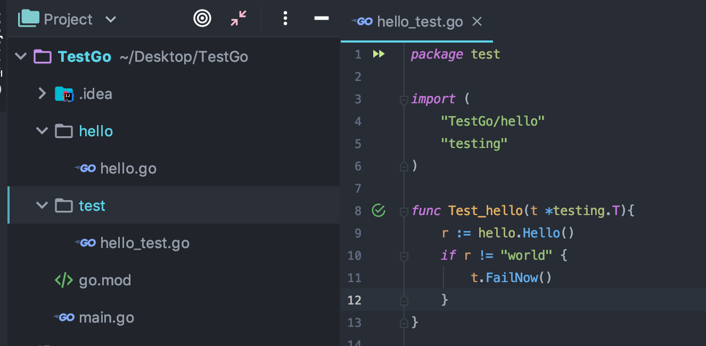

## 一 单元测试

#### 1.1 单元测试简介

单元测试用来检测某个模块、某个函数的执行结果是否正确，也因此能够实现监控代码质量。  

Go语言中自带有一个轻量级的测试框架 testing，同时也自带了 `go test` 命令，可以通过这些工具来实现单元测试和性能测试。

#### 1.2 testing的使用

go自带的testing单元测试框架使用要求：
- 测试代码必须放在以`_test.go`结尾的文件中
- 测试函数以`Test`为名称前缀
- 命令`go test`会忽略以 `_`或`.`开头的测试文件
- 命令`go build/install`等正常编译操作会忽略测试文件


#### 1.3 案例  

文件目录：
  

源码文件：`/hello/hello.go`
```go
package hello

import "fmt"

func Hello() string{
	return "world"
}
```

测试文件：`/test/hello_test.go`
```go
package test

import (
	"TestGo/hello"
	"testing"
)

func Test_hello(t *testing.T){
	r := hello.Hello()
	if r != "world" {
		t.FailNow()
	}
}
```

运行测试文件：没有main方法也可以执行
```
go test -v test/hello_test.go 							# -v用于显示详细测试流程
go test -v -run Test_hello test/hello_test.go 			# 只执行Test_hello
```

## 二 基准测试

#### 2.1 基准测试简介

基准测试可以测试一段程序的运行性能及耗费CPU的程度。  

性能测试函数以Benchmark为名称前缀，同样保存在`*_test.go`文件里。  

#### 2.2 基准测试案例

需要被基准测试的方法写为：
```go
func Benchmark_Hello(b *testing.B){
	var num int
	for i := 0; i < 1000000; i++ {
		num = num * i
	}
}
```

测试：
```
go test -v -bench=. test/helloworld_test.go 		# win下命令为 -bench="-"  -bench=.表示运行后面文件里的所有基准测试。
```

常用参数：
```
-benchtime=5s		# 自定义测试时间为5秒
-bench=Alloc		# 显示内存分配
```

## 三 代码覆盖率

```
go test -cover
```