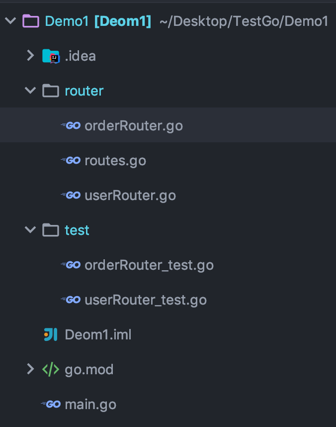

## 一 路由分组

访问路径是：`/user/login` 和 `/user/signin`
```go
package main

import (
	"github.com/gin-gonic/gin"
)

func login(c *gin.Context) {
	c.JSON(300, gin.H{
		"msg": "login",
	})
}

func logout(c *gin.Context) {
	c.JSON(300, gin.H{
		"msg": "logout",
	})
}

func main() {

	router := gin.Default()

	user := router.Group("/user")
	{
		user.GET("/login", login)
		user.GET("/logout", logout)
	}

	router.Run(":3000")
}
```

## 二 路由设计

#### 2.0 项目结构

笔者自己的路由设计，仅供参考：  

项目结构如图：  


#### 2.1 main.go

main.go：
```go
package main

import (
	"Demo1/router"
)

func main() {
	r := router.InitRouter()
	_ = r.Run()
}
```

#### 2.2 路由模块化核心 routes.go

routes.go：
```go
package router

import (
	"github.com/gin-gonic/gin"
)

func InitRouter() *gin.Engine {

	r := gin.Default()

	// 路由模块化
	userRouter(r)
	orderRouter(r)

	return r
}

```

#### 2.3 业务处理

userRouter.go示例：
```go
package router

import (
	"github.com/gin-gonic/gin"
	"net/http"
)

func userRouter(r *gin.Engine) {

	r.GET("/user/login", userLogin)

}

func userLogin(c *gin.Context) {
	c.JSON(http.StatusOK, gin.H{
		"code": 10001,
		"msg": "登录成功",
		"data": nil,
	})
}
```

## 三 理解路由

#### 3.1 路由树

在 Gin 框架中，路由规则被分成了最多 9 棵前缀树，每一个 HTTP Method对应一棵「前缀树」，树的节点按照 URL 中的 / 符号进行层级划分，URL 支持 :name 形式的名称匹配，还支持 *subpath 形式的路径通配符。 
```
// 匹配单节点 named
pattern = /book/:id
match /book/123
nomatch /book/123/10
nomatch /book/

// 匹配子节点 catchAll mode
/book/*subpath
match /book/
match /book/123
match /book/123/10
```

每个节点都会挂接若干请求处理函数构成一个请求处理链 HandlersChain。当一个请求到来时，在这棵树上找到请求 URL 对应的节点，拿到对应的请求处理链来执行就完成了请求的处理。  

```go
type Engine struct {
  ...
  trees methodTrees
  ...
}

type methodTrees []methodTree

type methodTree struct {
	method string
	root   *node  // 树根
}

type node struct {
  path string // 当前节点的路径
  ...
  handlers HandlersChain // 请求处理链
  ...
}

type HandlerFunc func(*Context)

type HandlersChain []HandlerFunc

```

Engine 对象包含一个 addRoute 方法用于添加 URL 请求处理器，它会将对应的路径和处理器挂接到相应的请求树中:
```go
func (e *Engine) addRoute(method, path string, handlers HandlersChain)
```

#### 3.2 路由组

RouterGroup 是对路由树的包装，所有的路由规则最终都是由它来进行管理。Engine 结构体继承了 RouterGroup ，所以 Engine 直接具备了 RouterGroup 所有的路由管理功能，同时 RouteGroup 对象里面还会包含一个 Engine 的指针，这样 Engine 和 RouteGroup 就成了「你中有我我中有你」的关系。  

```go
type Engine struct {
  RouterGroup
  ...
}

type RouterGroup struct {
  ...
  engine *Engine
  ...
}

```

RouterGroup 实现了 IRouter 接口，暴露了一系列路由方法，这些方法最终都是通过调用 Engine.addRoute 方法将请求处理器挂接到路由树中。  

RouterGroup 内部有一个前缀路径属性，它会将所有的子路径都加上这个前缀再放进路由树中。有了这个前缀路径，就可以实现 URL 分组功能。  


