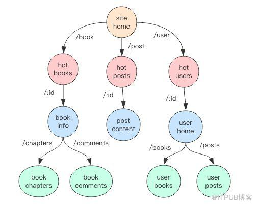

## 一 gin.Engine

Engine是框架的入口，是gin框架的核心，通过Engine对象来定义服务路由信息、组装插件、运行服务。不过Engine的本质只是对内置HTTP服务的包装。  

`gin.Default()` 函数会生成一个默认的 Engine 对象，包含2个默认常用插件
- Logger：用于输出请求日志
- Recovery：用于确保单个请求发生 panic 时记录异常堆栈日志，输出统一的错误响应。  

```go
func Default() *Engine {
	engine := New()
	engine.Use(Logger(), Recovery())
	return engine
}
```

## 二 gin的路由

###  2.1 路由树

在 Gin 框架中，路由规则被分成了最多 9 棵前缀树，每一个 HTTP Method对应一棵 前缀树 ，树的节点按照 URL 中的 / 符号进行层级划分，URL 支持 `:name` 形式的名称匹配，还支持 `*subpath` 形式的路径通配符：
```
// 匹配单节点 named
pattern = /book/:id
match /book/123
nomatch /book/123/10
nomatch /book/

// 匹配子节点 catchAll mode
/book/*subpath
match /book/
match /book/123
match /book/123/10
```

如图所示：  


每个节点都会挂接若干请求处理函数构成一个请求处理链 HandlersChain。当一个请求到来时，在这棵树上找到请求 URL 对应的节点，拿到对应的请求处理链来执行就完成了请求的处理。  

```go
type Engine struct {
  ...
  trees methodTrees
  ...
}

type methodTrees []methodTree

type methodTree struct {
	method string
	root   *node  // 树根
}

type node struct {
  path string // 当前节点的路径
  ...
  handlers HandlersChain // 请求处理链
  ...
}

type HandlerFunc func(*Context)

type HandlersChain []HandlerFunc

```

Engine 对象包含一个 addRoute 方法用于添加 URL 请求处理器，它会将对应的路径和处理器挂接到相应的请求树中:
```go
func (e *Engine) addRoute(method, path string, handlers HandlersChain)
```

### 2.2 路由组

RouterGroup 是对路由树的包装，所有的路由规则最终都是由它来进行管理。Engine 结构体继承了 RouterGroup ，所以 Engine 直接具备了 RouterGroup 所有的路由管理功能，同时 RouteGroup 对象里面还会包含一个 Engine 的指针，这样 Engine 和 RouteGroup 就成了「你中有我我中有你」的关系。  

```go
type Engine struct {
  RouterGroup
  ...
}

type RouterGroup struct {
  ...
  engine *Engine
  ...
}

```

RouterGroup 实现了 IRouter 接口，暴露了一系列路由方法，这些方法最终都是通过调用 Engine.addRoute 方法将请求处理器挂接到路由树中。  
```go
  GET(string, ...HandlerFunc) IRoutes
  POST(string, ...HandlerFunc) IRoutes
  DELETE(string, ...HandlerFunc) IRoutes
  PATCH(string, ...HandlerFunc) IRoutes
  PUT(string, ...HandlerFunc) IRoutes
  OPTIONS(string, ...HandlerFunc) IRoutes
  HEAD(string, ...HandlerFunc) IRoutes
  // 匹配所有 HTTP Method
  Any(string, ...HandlerFunc) IRoutes
```

RouterGroup 内部有一个前缀路径属性，它会将所有的子路径都加上这个前缀再放进路由树中。有了这个前缀路径，就可以实现 URL 分组功能。  
Engine 对象内嵌的 RouterGroup 对象的前缀路径是 /，它表示根路径。RouterGroup 支持分组嵌套，使用 Group 方法就可以让分组下面再挂分组，依次类推。  


### 2.3 HTTP错误  

当 URL 请求对应的路径不能在路由树里找到时，就需要处理 404 NotFound 错误。当 URL 的请求路径可以在路由树里找到，但是 Method 不匹配，就需要处理 405 MethodNotAllowed 错误。Engine 对象为这两个错误提供了处理器注册的入口。  

```go
func (engine *Engine) NoMethod(handlers ...HandlerFunc)
func (engine *Engine) NoRoute(handlers ...HandlerFunc)
```

异常处理器和普通处理器一样，也需要和插件函数组合在一起形成一个调用链。如果没有提供异常处理器，Gin 就会使用内置的简易错误处理器。  

注意这两个错误处理器是定义在 Engine 全局对象上，而不是 RouterGroup。对于非 404 和 405 错误，需要用户自定义插件来处理。对于 panic 抛出来的异常需要也需要使用插件来处理。  

### 2.4 HTTPS

Gin 不支持 HTTPS，官方建议是使用 Nginx 来转发 HTTPS 请求到 Gin。  