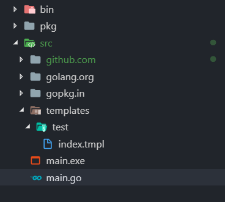

## 一 gin框架初识

#### 1.1 helloworld

gin框架中的路由是基于[httprouter](https://github.com/julienschmidt/httprouter)开发的。HelloWorld：
```go
package main

import (
	"github.com/gin-gonic/gin"
	"fmt"
)

func main() {

	r := gin.Default()	//Default返回一个默认路由引擎

	r.GET("/", func(c *gin.Context) {

		username := c.Query("username")

		fmt.Println(username)

		c.JSON(200, gin.H{
			"msg":"hello world",
		})
	})

	r.Run()			//默认位于0.0.0.0:8080，可传入参数 ":3030"

}
```

## 二 参数获取

#### 2.1 get请求参数

常见参数获取方式：
```
c.Query("username")
c.QueryDefault("username","lisi")       //如果username为空，则赋值为lisi
```

路由地址为：/user/:name/:pass，获取参数：
```go
name := c.Param("name")
```

#### 2.2 post请求参数获取

```go
name := c.PostForm("name")
```

#### 2.3 参数绑定

参数绑定利用反射机制，自动提取querystring，form表单，json，xml等参数到结构体中，可以极大提升开发效率。  

```go
package main

import (
	"net/http"
	"github.com/gin-gonic/gin"
	"fmt"
)

type User struct {
	Username string `form:"username" json:"username" binding:"required"`
	Password string `form:"password" json:"password" binding:"required"`
}

func login(c *gin.Context) {

	var user User

	fmt.Println(c.PostForm("username"))
	fmt.Println(c.PostForm("password"))

	err := c.ShouldBind(&user)
	if err != nil {
		c.JSON(http.StatusBadRequest, gin.H{
			"error": err.Error()
		})
	}

	c.JSON(http.StatusOK, gin.H{
		"username": user.Username,
		"password": user.Password,
	})
}


func main() {

	router := gin.Default()

	router.POST("/login", login)

	router.Run(":3000")
}
```

## 三 静态文件

静态化当前目录下static文件夹：
```go
	router := gin.Default()

	router.Static("/static", "./static")

	router.Run(":3000")
```
注意：同样推荐使用go build，不要使用开发工具的run功能。

## 四 结果返回

#### 4.1 返回JSON

```go
c.JSON(200,gin.H{"msg":"OK"})
c.JSON(200,结构体)
```

#### 4.2 返回模板

```go
	router.LoadHTMLGlob("templates/**/*")

	router.GET("/test/index", func(c *gin.Context){
		c.HTML(http.StatusOK, "test/index.tmpl", gin.H{
			"msg": "test",
		})
	})
```

模板文件：index.tmpl
```html

{{define "test/index.tmpl"}}
<html>

	<head>
	</head>

	<body>

		test...

		{{.}}
		-----
		{{.msg}}

	</body>

</html>

{{end}}
```

注意事项：不要使用编辑器的run功能，会出现路径错误，推荐使用命令build，项目路径分配如下：


## 五 文件上传

### 5.1 单文件上传

```go
 router.POST("/upload", func (c *gin.Context) {
	file, err := c.FormFile("file")
	if (err != nil) {
		c.JSON(http.StatusInternalServerError, gin.H{
			"msg": err.Error(),
		})
		return
	}
	dst := fmt.Sprintf("/uploads/&s", file.Filename)
	c.SavaeUpLoadedFile(file, dst)
	c.JSON(http.StatusOK, gin.H{
		"msg":"ok",
	})
 })
```

### 5.2 多文件上传

```go
 router.POST("/upload", func(c *gin.Context) {
        // 多文件
        form, _ := c.MultipartForm()
        files := form.File["upload[]"]

        for _, file := range files {
            log.Println(file.Filename)

            // 上传文件到指定的路径
            // c.SaveUploadedFile(file, dst)
        }
        c.String(http.StatusOK, fmt.Sprintf("%d files uploaded!", len(files)))
    })
```