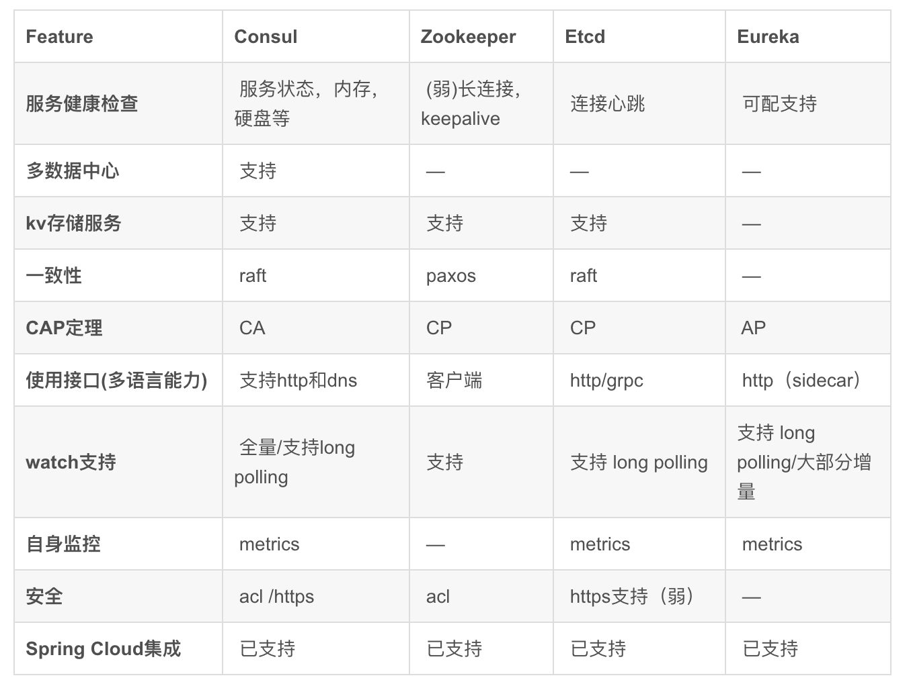

## 一 服务发现

#### 1.1 服务发现出现的缘由

因为一套微服务架构中有很多个服务需要管理，管理几百个服务所使用的端口列表是一大挑战，我们应该部署无需指定端口的服务，并让Docker为我们分配一个随机端口。  
那么问题就演变成了我们需要发现端口号，让别人知道。为了能够定位服务，需要下面2个步骤：
- 服务注册：该步骤存储的信息至少包括正在运行的服务的主机和端口信息
- 服务发现：该步骤允许其他用户可以发现在服务注册阶段存储的信息。

微服务的框架体系中，服务发现是不能不提的一个模块。客户端的一个接口需要调用多个服务，客户端必须知道所有服务的网络位置，以往的做法是使用配置文件，或者配置在数据库中，这就出现了一些问题：
- 需要配置N个服务的网络位置，加大配置的复杂性 
- 服务的网络位置变化，都需要改变每个调用者的配置 
- 集群的情况下，难以做负载(反向代理的方式除外)

有了服务发现模块，多个微服务把当前自己的网络位置注册 到服务发现模块(这里注册的意思就是告诉)，服务发现就以K-V的方式记录下，K一般是服务名，V就是 IP:PORT。服务发现模块定时的轮询查看这些服务能不能访问的了(这就是健康检查)。客户端在调用服务A-N的 时候，就跑去服务发现模块问下它们的网络位置，然后再调用它们的服务。  

客户端完全不需要记录这些服务网络位置，客户端和服务端完全解耦!

#### 1.2 需要额外考虑的地方

如果一个服务停止工作并部署/注册了一个新的服务实例，那么该服务是否应该注销呢？当有相同服务的多个副本时咋办？我们该如何做负载均衡呢？如果一个服务器宕机了咋办？所有这些问题都与注册和发现阶段紧密关联。现在，我们限定只在服务发现的范围里（常见的名字，围绕上述步骤）以及用于服务发现任务的工具，它们中的大多数采用了高可用的分布式键/值存储，这就是服务发现工具需要实现的功能。  

#### 1.3 服务发现工具

服务发现背后的基本思想是对于服务的每一个新实例（或应用程序），能够识别当前环境和存储相关信息。存储的注册表信息本身通常采用键/值对的格式，由于服务发现经常用于分布式系统，所以要求这些信息可伸缩、支持容错和分布式集群中的所有节点。这种存储的主要用途是给所有感兴趣的各方提供最起码诸如服务IP地址和端口这样的信息，用于它们之间的相互通讯，这些数据还经常扩展到其它类型的信息服务发现工具倾向于提供某种形式的API，用于服务自身的注册以及服务信息的查找。  

比方说我们有两个服务，一个是提供方，另一个是第一个服务的消费者，一旦部署了服务提供方，就需要在服务发现注册表中存储其信息。接着，当消费者试图访问服务提供者时，它首先查询服务注册表，使用获取到的IP地址和端口来调用服务提供者。为了与注册表中的服务提供方的具体实现解耦，我们常常采用某种代理服务。这样消费者总是向固定IP地址的代理请求信息，代理再依次使用服务发现来查找服务提供方信息并重定向请求，在本文中我们稍后通过反向代理来实现。现在重要的是要理解基于三种角色（服务消费者、提供者和代理）的服务发现流程。  

服务发现工具要查找的是数据，至少我们应该能够找出服务在哪里？服务是否健康和可用？配置是什么样的？既然我们正在多台服务器上构建一个分布式系统，那么该工具需要足够健壮，保证其中一个节点的宕机不会危及数据，同时，每个节点应该有完全相同的数据副本，进一步地，我们希望能够以任何顺序启动服务、杀死服务或者替换服务的新版本，我们还应该能够重新配置服务并且查看到数据相应的变化。

## 二 常用的服务发现技术

#### 2.0 常见服务发现技术列表

- zookeeper：历史最悠久，起源于Hadoop，成熟、健壮、生态丰富，已经被大量公司使用。但是其过于复杂、重量级，后续诞生了许多替代品
- etcd：是一个采用http协议的jkv存储系统，搭配第三方工具后可以提供服务发现功能：Registrator、Confd
- Eureka：
- consul：

特点对比：
  

#### 2.1 健康检查对比

- consul：非常详细，如检查内存占用是否到达90%、文件系统空间是否不足
- Zookeeper、etcd在失去了和服务进程连接的情况下任务不健康
- Euraka需要显式配置健康检查

#### 2.2 多数据中心支持对比

- consul：使用WAN的Gossip协议，完成了跨数据中心同步，其他产品则需要额外开发工具链

#### 2.3 CAP理论取舍对比

- consul、Eureka：典型的AP，适合分布式服务，服务发现的可用性优先级较高，consul更能提供更高的可用性、保证KV stor的一致性
- zookeeper、etcd：CP类型，牺牲可用性，在服务发现场景优势较弱

#### 2.4 kv支持对比

只有Eureka不支持。

#### 2.5 跨语言支持对比

- consul：支持http1.1接入，还支持标准的REST服务api，还提供了DNS支持
- etc：支持http1.1接入，还支持grpc
- Zookeeper：跨语言支持较弱
- Euraka：一般通过sidecar的方式提供多语言客户端接入支持

#### 2.6 watch支持对比（客户端观察到服务提供者变化）

- consul：使用长轮询方式实现变化感知
- etcd：使用长轮询方式实现变化感知
- Zookeeper：支持服务端推送变化
- Eureka：1.0版本使用长轮询方式实现变化感知，2.0版本计划支持服务端推送变化

#### 2.7 自身集群监控

除了Zookeeper，其他都默认支持metrics，可以搜集并报警这些度量信息达到监控目的

#### 2.8 其他

Java著名微服务架构体系SpringCloud对上述四者都提供了集成，但对Cponsul支持较为完善。  

参考地址：http://dockone.io/article/667  