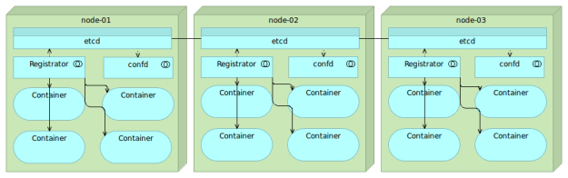

## 一 etcd实现服务发现

etcd是一个采用HTTP协议的健/值对存储系统，它是一个分布式和功能层次配置系统，可用于构建服务发现系统。对比庞大的conusl和Zookeeper，etcd系统本身极为简单（因为仅仅是一个分布式kv存储），但是他需要搭配一些第三方工具才可以实现服务发现功能。    

现在，我们有一个地方来存储服务相关信息，我们还需要一个工具可以自动发送信息给etcd。但在这之后，为什么我们还需要手动把数据发送给etcd呢？即使我们希望手动将信息发送给etcd，我们通常情况下也不会知道是什么信息。记住这一点，服务可能会被部署到一台运行最少数量容器的服务器上，并且随机分配一个端口。理想情况下，这个工具应该监视所有节点上的Docker容器，并且每当有新容器运行或者现有的一个容器停止的时候更新etcd，其中的一个可以帮助我们达成目标的工具就是Registrator。  

Registrator通过检查容器在线或者停止运行状态自动注册和去注册服务，它目前支持etcd、Consul和SkyDNS 2。

Registrator与etcd是一个简单但是功能强大的组合，可以运行很多先进的技术。每当我们打开一个容器，所有数据将被存储在etcd并传播到集群中的所有节点。我们将决定什么信息是我们的。  

我们还需要一种方法来创建配置文件，与数据都存储在etcd，通过运行一些命令来创建这些配置文件。  

Confd是一个轻量级的配置管理工具，常见的用法是通过使用存储在etcd、consul和其他一些数据登记处的数据保持配置文件的最新状态，它也可以用来在配置文件改变时重新加载应用程序。换句话说，我们可以用存储在etcd（或者其他注册中心）的信息来重新配置所有服务。  

最后的组合如图所示：
  

当etcd、Registrator和Confd结合时，可以获得一个简单而强大的方法来自动化操作我们所有的服务发现和需要的配置。这个组合还展示了“小”工具正确组合的有效性，这三个小东西可以如我们所愿正好完成我们需要达到的目标，若范围稍微小一些，我们将无法完成我们面前的目标，而另一方面如果他们设计时考虑到更大的范围，我们将引入不必要的复杂性和服务器资源开销。