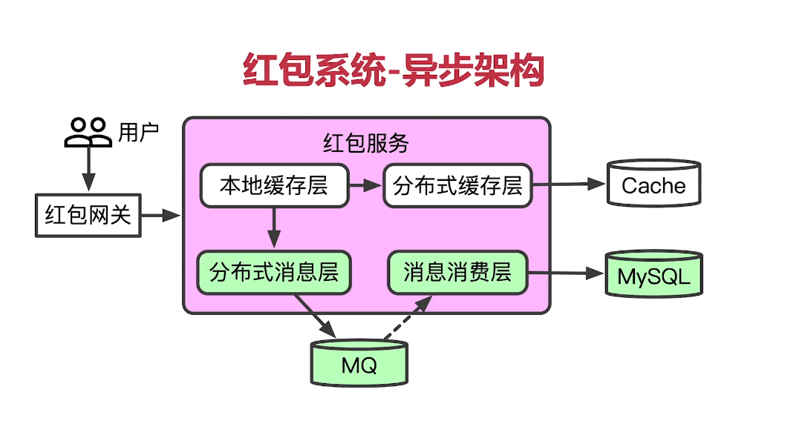

##  超卖现象 

在电商类应用中，尤其是秒杀、抢红包等场景，要严格避免出现超卖现象。  

超卖现象有很多解决方案，在数据库层有下列解决方案：
- 方案一：锁定操作行，`select quantity from commodity where id = ? for update;`，这是悲观锁(查询数量时上锁，再更新，完成后释放)，适合写入多、写冲突多场景，性能极低
- 方案二：将剩余数量字段类型设置为无符号整数，此时字段一旦变为负数，直接报错`value is out of range`
- 方案三：乐观锁，假设数据不会被其他人修改，只有自己，操作时验证一下，先比较再更新（CAS），适合写少、写冲突少场景

方案三的具体sql：
```
# 方式一：使用case语句
update commodity set quantity = case case_value when commodity >= 扣减数量 then commodity - 扣减数量 else commodity end case where id = ?;

# 方式二：where中条件判断
update commodity set quantity = quantity - 扣减数量 where id = ? and quantity >= 扣减数量;
```

如果要在数据库层解决该问题，推荐方案：无符号正整数+乐观锁，因为可以双重保险，且具有较好的性能。  

## 抢红包架构



## 抢红包Golang简单实现

=======TODO=======
