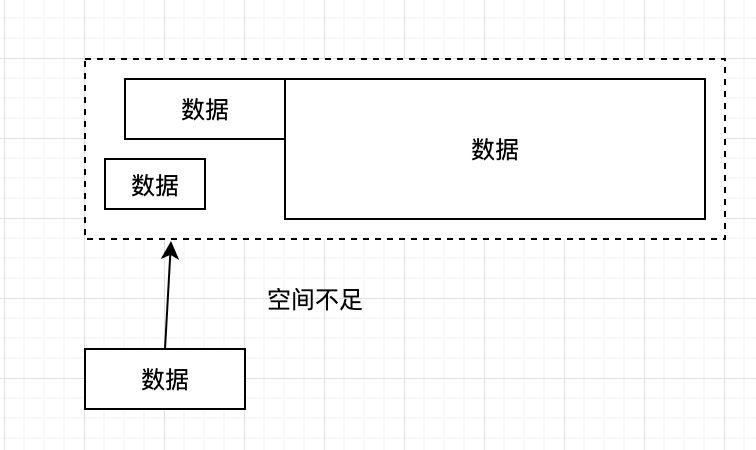

## 一 栈与堆

栈只允许往线性表的一端放入数据，之后在这一端取出数据，遵照先进后出的原则。  

  

往栈中放入元素的过程叫做入栈，入栈会增加栈的元素数量，最后放入的元素总是位于栈的顶部，最先放入的元素总是位于栈的底部。从栈中取出元素，也只能从栈顶开始取。  

栈可以用于内存的分配，栈的分配和回收速度非常快。  

堆在内存分配中类似于在一个房间里摆放各种家具，家具的尺寸大小不一，需要找一块足够装下某种家具的空间再摆放家具。经过反复摆放和腾空家具后，房间里的空间就会变得乱七八糟，此时再往空间里摆放家具会存在虽然有足够的空间，但是各个空间分布在不同的区域，无法有一端连续的空间来摆放家具。此时，内存分配器就需要对这些空间进行调整优化，如图：

  

和栈分配内存相比，堆适合不可预知大小的内存分配，代价是分配速度慢，容易形成内存碎片。  

## 二 变量逃逸  

#### 2.1 变量逃逸案例1
在C++中，开发者需要自己手动分配内存来适应不同的算法需求。比如，函数局部变量尽量使用栈（函数退出，内部变量也依次退出），全局变量、结构体使用堆。  

Go语言将这个过程整合到了编译器中，命名为“变量逃逸分析”，这个技术由编译器分析代码的特征和代码生命期，决定是堆还是栈进行内存分配。  

```go

package main

import (
	"fmt"
)

func test(num int) int {
	var t int
	t = num
	return t 
}

//空函数，什么也不做
func void() {

}

func main() {

	var a int					//声明变量并打印
	void()						//调用空函数
	fmt.Println(a, test(0))		//打印a，并调用test

}
```

运行上述代码:
```
 # -gcflags参数是编译参数，-m表示进行内存分析，-l表示避免程序内联（优化）
go run -gcflags "-m -l" test.go    
```

得到结果：
```
# command-line-arguments
./test.go:22:13: a escapes to heap                      # 29行的变量逃逸到堆
./test.go:22:21: test(0) escapes to heap                # test(0)调用逃逸到堆
./test.go:22:13: main ... argument does not escape      # 默认提示
0 0
```

test(0)调用逃逸到堆，但是test()函数会返回一个整数值，这个值被fmt.Println()使用后还是会在其声明后继续在main函数中存在。  

test函数中的声明的变量t是整型，该值通过test函数返回值逃出了函数，t变量的值被复制并作为test函数的返回值返回，即使t在test函数中分配的内存被释放，也不会影响main函数中使用test返回的值，t变量使用栈分配不会影响结果。


#### 2.2 变量逃逸案例2

```go
package main

import "fmt"

type Data struct {

}

func test() *Data {
	var d Data
	return &d 				// 返回局部变量地址
}

func main() {
	fmt.Println(test())		//输出 &{}
}
```

继续使用命令：`go run -gcflags "-m -l" test.go`
```
# command-line-arguments
./test.go:11:9: &d escapes to heap
./test.go:10:6: moved to heap: d                    # 新增提示：将d移到堆中
./test.go:15:18: test() escapes to heap
./test.go:15:13: main ... argument does not escape
&{}
```

` moved to heap: d` 表示go编译器已经确认如果c变量被分配在栈上是无法保证程序最终结果的，如果坚持这样做，test()的返回值僵尸Data结构的一个不可预知的内存地址。这种情况一般是C/C++语言中容易犯错的地方：引用了一个函数局部变量的地址。Go最终选择将d的Data结构分配到堆上，然后由垃圾回收期去回收c的内存。  

#### 2.3 原则总结

在使用Go语言进行编程时，Go语言设计者不希望开发者将经历放在内存应该分配在栈还是堆上，编译器会自动帮助开发者完成这个纠结的选择，编译器觉得变量应该分配在堆还是栈上的原则是：
- 变量是否被取地址
- 变量是否发生逃逸

