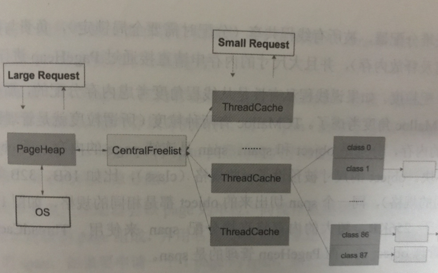

## 内存管理
#### 1.1 内存分配简介
古老的内存分配方式：
首先确定内存是不是够用，够用就从内存中取一点来运行程序，用完了放回内存池中，负责这个过程的就是内存分配程序。
程序的动态性越强，内存管理就越重要。
计算机上每一个进程都认为自己可以访问所有的物理内存，但是实际上由于运行着多个程序，每个进程不可能拥有全部内存，这时候需要有一种能够欺骗进程的东西，即虚拟内存。
如果要实现虚拟内存，首先要避免让进程直接接触到实际的物理地址，因此物理内存被操作系统组织成一个数组，这个数组由N个连续的字节大小的单元组成，每个字节都有一个唯一的物理地址(PA)。现代处理器使用的是一种虚拟寻址(VA)的寻址形式，最小的寻址单位是字，虚拟地址映射物理地址是通过读取页表进行地址翻译完成的--页表存放在物理存储器中，内核把物理页作为内存管理的基本单位，以页为单位管理内存中的页表。
操作系统维持着一个虚拟地址到物理地址的转换表，以便计算机硬件剋有正确的响应地址请求，如果地址在硬盘上而不是在内存中，操作系统将暂时停止该进程（这种存储在硬盘的内存数据，win称为虚拟内存，Linux称为Swap）。当空间有余或者优先度提高后，再从硬盘上加载被进程请求的内存，再重新启动进程。这样，每个进程都获得了自己可以使用的地址空间，可以访问比物理上安装的内存更多的内存。
理论上，64位系统每一个进程最多可以访问128G内存，但是当加载一个进程时，它会得到一个取决于称为系统中断点的特定地址，这是一个初始内存分配的值，该地址之后是未被映射的内存，不能被进程调用，所以一个进程绝对不可能使用超过128G的内存。
在Linux系统中，有2个可以映射到物理内存的函数：brk()和mmap()，都是用来增减进程的虚拟内存。不过brk()只是单纯的将系统中断点向前/后移动，以改变今后曾可以获得的内存大小。
Go语言再内存分配上的底层函数是mmap()，可以映射任何内存位置的内存，不局限于进程，也可以将虚拟地址映射到物理内存或者虚拟内存，还可以将虚拟地址映射到闻不见和文件位置，这样可以在读写内存时直接对文件中的数据进行读写。
#### 1.2 内存中的堆栈（非数据结构）
早期计算机中，内存分配基于栈，由于栈是连续的，可以有效避免内存碎片化，但是栈不利于管理大内存，数据的生命周期难于控制（栈pop时后申请的内存必须早于先申请的内存），所以栈不利于动态管理和利用内存资源。
内存分配和垃圾回收都属于动态存储分配，动态存储分配器维护的虚拟内存称为堆，但是堆的内存分配效率很低。
假如内存是从上往下的一个梯子，栈区位于相对较高的位置，地址向下增长，堆区向上增长。栈区一般由操作系统自动分配释放，是一块连续的内存区域，数据结构是一个栈，而堆区一般由程序员释放，或者OS回收，数据结构类似链表。
静态分配是系统编译器完成的，比如局部变量的分配，即一般的内存分配器会把局部变量分配的栈区，堆区用于分配开发人员申请的内存。
静态变量，全局变量一般是分配到堆区的，只读区是分配常量和程序代码空间的。
Go中无需分配对象上，这是Go的特性。编译器在编译时自动判断对象应该分配到哪里。

#### 1.3 逃逸分析
由于栈的性能远比堆好，一个变量被分配到堆还是栈，对性能和安全都有较大影响。逃逸分析是一种确定指针动态范围的方法，可以分析在程序的哪些地方可以访问到指针。当一个变量或对象在子程序中被分配时，一个指向变量或对象的指针可能逃逸到其他执行线程中，甚至去调用子程序。
例如：一个子程序分配一个对象，并且返回该对象的指针，该对象可能在程序任何地方被访问到，这个指针就逃逸了。
```Go
package main

func toHeap() *int {
	var x int           //分配到堆上
	return &x
}

func toStack() int {
	x := new(int)       //分配到栈上
	*x = 1
	return *x
}

func main(){

}
```
运行命令:
```
go run -gcflags -m main.go          //-m是打印编译器自动优化策略
```
分析结果:
```
# command-line-arguments
.\main.go:3:6: can inline toHeap
.\main.go:8:6: can inline toStack
.\main.go:14:6: can inline main
.\main.go:5:9: &x escapes to heap
.\main.go:4:6: moved to heap: x
.\main.go:9:10: toStack new(int) does not escape        //逃逸分析：确定指针所有可以存储的地方，保证指针的生命周期只在当前进程或线程中
```
两个函数分配到了不一样的内存中，因为Go在一定程度上消除了堆栈区别，编译时自动进行逃逸分析，不逃逸的对象放到栈上，可能逃逸的对象放到堆上。
上述的内存被自动分配了，如何手动分配？
- Go中的变量只要被引用，就会一直存活，存储在堆上还是栈上由内部实现决定
- 一般会把局部变量分配到函数栈上
- 如果变量在函数return之后还会被引用，编译器就会将变量分配到堆上
- 如果一个局部变量非常大，那么会被分配到堆上
- 如果一个变量被取地址（*和&操作），可能会被分配到堆上，最终按照逃逸分析结果为准
- 如果函数return后变量不再被引用，则分配到栈上
案例：
```Go
type S struct {

}

func toHeap(s S) *S {
	return &s
}

func toStack(s *S) *S {
	return s
}

func main(){
	var s S
	x := &s
	_ = toStack(x)
	_ = toHeap(s)
}
```
使用上述命令可以看到编译时，堆栈分配已经完成，如果Go编译器不知道两个变量的给关系，会不会分配失误？
```Go
type S struct {
	M *int
}
func ref(x *int, y *S){
	y.M = x
}
func main(){
	var a int
	var s S
	ref(&a, &s)
}

```
在上述案例中，ref函数中的x赋值给y的成员，即a被外部引用了，所以a需要存在堆中，避免a丢失数据
s始终在main中引用，即便在ref中只是被赋值而已，不会再函数（子程序）外部被访问，没有逃逸可能。
## 三 TCMalloc
#### 3.1 TCMalloc简介
常见的内存分配器：
PTMalloc：glibc开发
TCMalloc：Google开发
HEMalloc：Google开发
Go的内存分配基于TCMalloc（谷歌开发的一个内存分配器）。
TCMalloc特别堆多线程做了优化，对于小对象的分配基本上不存在锁竞争，而大对象使用细粒度，高效的自旋锁，因此适合高并发场景。
TCMalloc内存管理体系分为三个层次：ThreadCache，CentralCache，PageHeap。

内存的分配再各个层次逐渐尝试：
当最小的ThreadCache层分配失败，则从下一层的CentralCache中分配一批补上来，还不够就再从PageHeap中索取，最后找操作系统索取。
再释放内存时，ThreadCache层释放了过多的内存，则回收一批到CentralCache层，以此类推逐级回收到PageHeap并最终返还给操作系统。
TCMalloc特点:
- 线程私有性：ThreadCache是每个线程都有一份的，理想状态下，每个线程的内存申请都可以再自己的ThreadCache里完成，线程之间不需要竞争，因此很高效。但是理想情况不可能达到，ThreadCache不可能永远满足线程需求，需要依次索要内存。PageHeap是中央分配器，被所有线程共享，分配时需要全局锁定，负责与操作系统的直接交互（申请和释放），并且大的内存申请会直接通过PageHeap分配。
- 内存分配粒度：TCMalloc有两种粒度的内存，分别是object和span。span是连续的page的内存，而object则是由span切成的小块，object被预先切成了16B，32B等88种不同规格，同一个span切出来的object是相同的规格，object不会大于256KB，超大的内存直接分配给span使用。ThreadCache和CentralCache是管理object的，而PageHeap管理的是span。
上述两点是TCMalloc的核心，被称为离散式空闲列表算法，在申请小内存时候（小于256KB）时，TCMalloc会根据申请内存的大小，匹配到被最贴近大小的切好的区域中。
