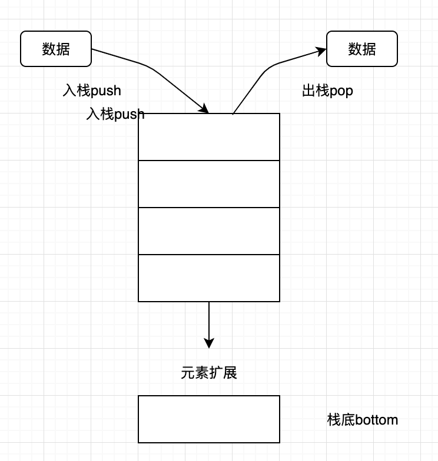
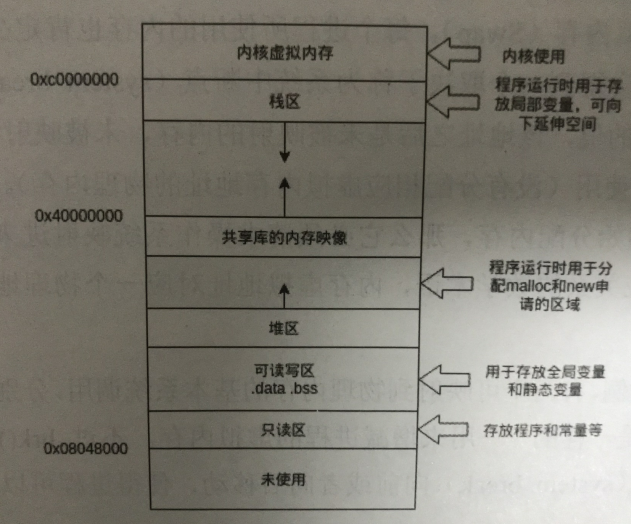

## 一 内存分配

古老的内存分配方式：
- 先确定内存是不是够用，够用就从内存中取一点来运行程序
- 程序运行结束后将获取到的内存放回内存池中

计算机上每一个进程都认为自己可以访问所有的物理内存，但是实际上由于运行着多个程序，每个进程不可能拥有全部内存，这时候需要有一种能够欺骗进程的东西，即虚拟内存。  

如果要实现虚拟内存，首先要避免让进程直接接触到实际的物理地址，因此物理内存被操作系统组织成一个数组，这个数组由N个连续的字节大小的单元组成，每个字节都有一个唯一的物理地址(PA)。  

现代处理器使用的是一种虚拟寻址(VA)的寻址形式，最小的寻址单位是字，虚拟地址映射物理地址是通过读取页表进行地址翻译完成的。  

注意：页表存放在物理存储器中，内核把物理页作为内存管理的基本单位，以页为单位管理内存中的页表。  

操作系统维持着一个虚拟地址到物理地址的转换表，以便计算机硬件剋有正确的响应地址请求。如果地址在硬盘上而不是在内存中，操作系统将暂时停止该进程（这种存储在硬盘的内存数据，win称为虚拟内存，Linux称为Swap）。当空间有余或者优先度提高后，再从硬盘上加载被进程请求的内存，再重新启动进程。这样，每个进程都获得了自己可以使用的地址空间，可以访问比物理上安装的内存更多的内存。  

理论上，64位系统每一个进程最多可以访问128G内存，但是当加载一个进程时，它会得到一个取决于称为系统中断点的特定地址，这是一个初始内存分配的值，该地址之后是未被映射的内存，不能被进程调用，所以一个进程绝对不可能使用超过128G的内存。  

在Linux系统中，有2个可以映射到物理内存的函数：`brk()`和`mmap()`，都是用来增减进程的虚拟内存。不过`brk()`只是单纯的将系统中断点向前/后移动，以改变今后曾可以获得的内存大小。   

Go语言再内存分配上的底层函数是mmap()，可以映射任何内存位置的内存，不局限于进程，也可以将虚拟地址映射到物理内存或者虚拟内存，还可以将虚拟地址映射到闻不见和文件位置，这样可以在读写内存时直接对文件中的数据进行读写。

## 二 栈与堆（非数据结构）

#### 2.1 栈与堆结构的特性

栈只允许往线性表的一端放入数据，之后在这一端取出数据，遵照先进后出的原则。  

  

往栈中放入元素的过程叫做入栈，入栈会增加栈的元素数量，最后放入的元素总是位于栈的顶部，最先放入的元素总是位于栈的底部。从栈中取出元素，也只能从栈顶开始取。  

栈可以用于内存的分配，栈的分配和回收速度非常快。  

堆在内存分配中类似于在一个房间里摆放各种家具，家具的尺寸大小不一，需要找一块足够装下某种家具的空间再摆放家具。经过反复摆放和腾空家具后，房间里的空间就会变得乱七八糟，此时再往空间里摆放家具会存在虽然有足够的空间，但是各个空间分布在不同的区域，无法有一端连续的空间来摆放家具。此时，内存分配器就需要对这些空间进行调整优化，如图：

  

和栈分配内存相比，堆适合不可预知大小的内存分配，代价是分配速度慢，容易形成内存碎片。  

#### 2.2 计算机内存分配

早期计算机中，内存分配基于栈，由于栈是连续的，可以有效避免内存碎片化，但是栈不利于管理大内存，数据的生命周期难于控制（栈pop时后申请的内存必须早于先申请的内存），所以栈不利于动态管理和利用内存资源。  


内存分配和垃圾回收都属于动态存储分配，动态存储分配器维护的虚拟内存称为堆，但是堆的内存分配效率很低。  

假如内存是从上往下的一个梯子，栈区位于相对较高的位置，地址向下增长，堆区向上增长。栈区一般由操作系统自动分配释放，是一块连续的内存区域，数据结构是一个栈，而堆区一般由程序员释放，或者OS回收，数据结构类似链表。  

静态分配是系统编译器完成的，比如局部变量的分配，即一般的内存分配器会把局部变量分配的栈区，堆区用于分配开发人员申请的内存。  

静态变量，全局变量一般是分配到堆区的，只读区是分配常量和程序代码空间的。  

Go自带GC，无需手动分配，编译器在编译时自动判断对象应该分配到哪里：  



## 三 变量逃逸  

#### 3.1 变量逃逸案例1

在C++中，开发者需要自己手动分配内存来适应不同的算法需求。比如，函数局部变量尽量使用栈（函数退出，内部变量也依次退出），全局变量、结构体使用堆。  

Go语言将这个过程整合到了编译器中，命名为“变量逃逸分析”，这个技术由编译器分析代码的特征和代码生命期，决定是堆还是栈进行内存分配。  

```go
func test(num int) int {
	var t int
	t = num
	return t 
}

//空函数，什么也不做
func void() {

}

func main() {

	var a int					//声明变量并打印
	void()						//调用空函数
	fmt.Println(a, test(0))		//打印a，并调用test

}
```

运行上述代码:
```
# -gcflags参数是编译参数，-m表示进行内存分析，-l表示避免程序内联（优化）
go run -gcflags "-m -l" test.go    
```

得到结果：
```
# command-line-arguments
./test.go:22:13: a escapes to heap                      # 29行的变量a逃逸到堆
./test.go:22:21: test(0) escapes to heap                # test(0)调用逃逸到堆
./test.go:22:13: main ... argument does not escape      # 默认提示
0 0
```

test(0)调用逃逸到堆，但是test()函数会返回一个整数值，这个值被fmt.Println()使用后还是会在其声明后继续在main函数中存在。  

test函数中的声明的变量t是整型，该值通过test函数返回值逃出了函数，t变量的值被复制并作为test函数的返回值返回，即使t在test函数中分配的内存被释放，也不会影响main函数中使用test返回的值，t变量使用栈分配不会影响结果。


#### 3.2 变量逃逸案例2

```go
type Data struct {

}

func test() *Data {
	var d Data
	return &d 				// 返回局部变量地址
}

func main() {
	fmt.Println(test())		//输出 &{}
}
```

继续使用命令：`go run -gcflags "-m -l" test.go`
```
# command-line-arguments
./test.go:11:9: &d escapes to heap
./test.go:10:6: moved to heap: d                    # 新增提示：将d移到堆中
./test.go:15:18: test() escapes to heap
./test.go:15:13: main ... argument does not escape
&{}
```

` moved to heap: d` 表示go编译器已经确认如果c变量被分配在栈上是无法保证程序最终结果的，如果坚持这样做，test()的返回值是僵尸Data结构的一个不可预知的内存地址。这种情况一般是C/C++语言中容易犯错的地方：引用了一个函数局部变量的地址。Go最终选择将d的Data结构分配到堆上，然后由垃圾回收期去回收c的内存。  

#### 3.3 原则总结

在使用Go语言进行编程时，Go语言设计者不希望开发者将精力放在内存应该分配在栈还是堆上，编译器会自动帮助开发者完成这个纠结的选择。  

编译器觉得变量应该分配在堆还是栈上的原则是：
- 变量是否被取地址
- 变量是否发生逃逸

