## 零 前置知识

操作系统的每个进程都认为自己可以访问计算机的所有物理内存，但由于计算机必定运行着多个程序，每个进程都不能拥有全部内存。  

> 为了避免了进程直接访问实际的物理地址，操作系统会将物理内存虚拟为一个数组，每个元素都有一个唯一的物理地址（PA）。
> 物理存储其器中存储着一个页表（page table），该表即虚拟地址与物理地址的映射表，读取该也表，即可完成地址翻译。

假设一个程序访问地址为0x1001的内存，实际上，该数据并不一定是存储在0x1001的物理地址中，甚至也不在物理内存中（如果物理内存满了，则可以转移到磁盘上）。这些地址不必反映真实的物理地址，可以称为“虚拟内存”。  

## 一 内存分区

### 1.0 程序的内存使用

现在使用命令来查看Go程序的内存使用：
```
go build main.go
size main
```

此时会显示Go程序在未启动时，内存的使用情况：  

    

此时可执行程序内部已经分好了三段信息，分别为：
- text 代码区
- data 数据区
- bss 未初始化数据区 

贴士：
data和bss区域可以一起称呼为静态区/全局区  
- 上述三个区域大小都是固定的

程序在执行后，会额外增加栈区、堆区。  

### 1.1 text 代码区 

代码区用于存放CPU执行的机器指令，一般情况下，代码区具备以下特性：
- **共享**：即可以提供给其他程序调用，这样就可以让代码区的数据在内存中只存放一份即可，有效节省空间。
- **只读**：用于放置程序修改其指令
- 规划局部变量信息

### 1.2 data 数据区

数据区用于存储数据：
- 被初始化后的全局变量
- 被初始化后的静态变量（包含全局静态变量、局部静态变量）
- 常量数据（如字符串常量）

### 1.3 bss 未初始化数据区

未初始化数据区用于存储：
- 全局未初始化变量
- 未初始化静态变量

如果是C语言，未初始化，却被使用了，这会产生一个随机的值。Go语言中，为了防止C的这种现象，该区域的数据会在程序执行之前被初始化为零值（0或者空）。  

### 1.4 stack 栈区

栈是一种先进后出（FILO）的内存结构，由编译器自动进行分配和释放。一般用于存储：函数的参数值、返回值、局部变量等。栈区大小一般只有1M，也可以实现扩充：
- Windows最大可以扩充为10M
- Linux最大可以扩充为16M

### 1.5 heap 堆区

栈的内存空间非常小，当我们遇到一些大文件读取时，栈区是不够存储的，这时候就会用到堆区。堆区空间比较大，其大小与计算机硬件的内存大小有关。  

堆区没有栈的先进后出的规则，位于BSS区域栈区之间，用于内存的动态分配。  

在C、C++等语言中，该部分内存由程序员手动分配（c中的malloc函数，c++中的new函数）和释放（C中的free函数，C++的delete函数），如果不释放，可能会造成内存泄露，但是程序结束时，操作系统会进行回收。 

在Java、Go、JavaScript中，都有垃圾回收机制(GC)，可以实现内存的自动释放！  


注意：Go语言与其他语言不同，对栈区、堆区进行虚拟管理。

### 1.6 操作系统内存分配图

操作系统会为每个进程分配一定的内存地址空间，如图所示：  



上图所示的是32位系统中虚拟内存的分配方式，不同系统分配的虚拟内存是不同的，但是其数据所占区域的比例是相同的：
- 32位：最大内存地址为2<sup>32</sup>，这么多的字节数换算为G单位，即为4G。（换算为1G=1024MB=1024*1024KB=1024*1024*1024B）
- 64位：最大内存地址为2<sup>64</sup>，这么多的字节数换算为G单位，数值过大，不便图示

注意：**栈区是从高地址往低地址存储的**
