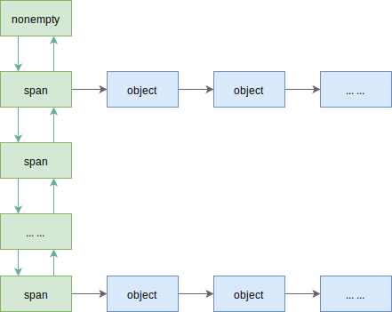

## 一 内存分配器

### 1.0 Golang的内存分配器TCMalloc

Go的内存分配基于TCMalloc（Thread-Cacing Malloc，Google开发的一款高性能内存分配器），源码位于`runtime/malloc.go`。但是经过多年发展，Go的内存分配算法已经大幅进化，但是学习TCMalloc仍然能看到一些Go内存分配的基础。  

Go采用离散式空闲列表算法（Segregated Free List）分配内存，主要核心算法思想是：
- 线程私有性
- 内存分配粒度

### 1.1 线程私有性

TCMalloc内存管理体系分为三个层次：
- ThreadCache：一般与负责小内存分配，每个线程都拥有一份ThreadCache，理想情况下，每个线程的内存申请都可以在自己的ThreadCache内完成，线程之间无竞争，所以TCMalloc非常高效，这既是**TCMalloc的线程私有性**
- CentralCache：内部含有多个CentralFreelist
- PageHeap：与负责大内存分配，是中央堆分配器，被所有线程共享，可以与操作系统直接交互（申请、释放内存），大尺寸内存分配会直接通过PageHeap分配

TCMalloc具备线程私有性质，然而现实往往是骨感的！ThreadCache中内存不足时，还需要其他2个组件帮助，内存的分配、释放从上述三个层级中依次递进：当最小的Thread层分配内存失败，则从下一层的CentralCache中分配一批补充上来。  

CentralFreeList是TheadCache和PageHeap之间协调者。
- 分配内存：CentralFreeList会将PageHeap中的内存切分为小块，分配给ThreadCache。
- 释放内存：CentralFreeList会获取从ThreadCache中回收的内存，归还给PageHeap。

如图所示：  

### 1.2 内存分配粒度

内存分配调度的最小单位也称为粒度，TCMalloc有两种分配粒度：
- span：用于内部管理。span是由连续的page内存组成的一个大块内存，负责分配超过256KB的大内存
- object：用于面向对象分配。object是由span切割成的小块，其尺寸被预设了一些规格（class），如16B，32B（88种），不会大于256KB（交给了span）。同一个span切出来的都是相同的object。

贴士：ThreadCache和CentralCache是管理object的，PageHeap管理的是span。  

如图所示（每个class对应一个链表）：  

在申请小内存（小于256KB时），TCMalloc会根据申请内存的大小，匹配到与之大小最接近的class中，如：
- 申请O～8B大小时，会被匹配到 class1 中，分配 8B 大小
- 申请9～16B大小时，会被匹配到 class2 中，分配 16 B大小

上述的分配方式可以既非常灵活，又能极大避免内存浪费！  

## 二 内存分配

### 2.0 分配的第一步

分配器以page为单位，向操作系统申请“大块内存”，这些大块内存由n个地址连续的page组成，并用名为span的对象进行管理。  

示例：现在拥有128page的span，如果要申请1page的span，则该span会被划分为2个：1+127，再把127page的span记录下来。

### 2.1 小内存分配

小内存分配对应的ThreadCache是TCMalloc三级分配的第一层，是一个TSL线程本地存储对象，负责小于256KB的内存申请。每个线程都独立拥有各自的离散式空闲列表，所以分配过程不需要锁，分配速度很高。  

ThreadCache在分配小内存时，首先会通过SizeMap查找要分配的内存所对应的class以及object大小，然后检查空闲列表（free list）是否为空：
- 如果非空，表示线程还有空闲的内存，那么直接从列表中移除第一个object并返回，这个过程不需要任何锁！  
- 如果未空，表示线程没有空闲的内存，那么从哪个CentralFreeList中获取若干object，因为CentralCache是被所有线程共享的，能够获取多少object是由慢启动算法决定的。获取的object会被分配到ThreadCache对应的class列表中，最终取出其中一个object返回

如果CentralFreeList中的object也不够用，则会向PageHeap申请一连串页面，这些页面被切割为一系列object，再将部分object转移给ThreadCache。  

如果PageHeap也不够用了,则会向操作系统申请内存(page为单位)，Go中此处使用mmap方法申请，或者通过在/dev/mem中映射。申请完毕后继续上面的操作，将内存逐级递送给线程。  

### 2.2 CentralCache

CentralCache内部含有多个CentralFreelist，即针对每一种class的object。ThreadCache维护的是object链表，CentralFreelist维护的是span链表。  

CentralFreelist示意图：  

在 span 内的 object 都已经空闲（free）的情况下，将 span 整体回收给 PageHeap。( span.refcount＿记录了被分配出去的 object 个数〉。但是如果每个回收的 object 都需要寻找自己所属的 span，然后才能挂进freelist，这样就比较耗时了。所以 CentralFreeList 里面还
维护了一个缓存 (tc_slots＿），回收的若干 object 先往缓存里塞，不管 object 大小如何，缓存满了再分类放进相应 span 的 object 链。相反，如果 ThreadCache 申请 object，也是先尝试在缓存里面给，没了再去 span 链那里申请。  

那么这个若干具体是多少个 object 呢？其实这是预定义的，称作 batch size，不同的class 可能有不同的值。 ThreadCache 向 Central Cache 分配或回收 object 时，都尽量以batch_size 为一个批次。而为了使得缓存简单高效，如果某次分配或者回收的 object 个数小于 batch size，则会绕过缓存，直接处理。  

为了避免在分配 object 时判断 span 是否为空,CentralFreeList 里的 span 链表被分为两个，分别是 nonempty＿ 和 empty＿，根据 span 的 objects 链是否有空闲，放入对应链表。当到了需要分配时，只需要在由空变非空、或者由非空变空时移动 span 就可以了。  

CentralFreeList 作为整个体系的中间人，它从 PageHeap 中获得 span ，并按照预定大小（ SizeMap 中的定义）将其分割成大小固定的 object ，然后 ThreadCache 可以共享 CentralFreeList 列表。  

当 ThreadCache 需要从 CentralFreeList 中获取 object 时，会从 nonempty 链表中获取第一个 span，并从这个 span 的 object 链表中获取可用 object 返回 。 当该 span 无可用 object时，将此span 从 nonempty_链表移除，并挂到 empty一链表上。  

当 ThreadCache 把 object 归还给 CentralFreeList 时，object 会找到它所属的 span，并挂载到 object 链表表头，如果 span 处在 empty＿链表， CentralFreeList 会重新将其挂载到nonempty_链表。   

span 里还有一个值用于计算 object 是否己满，每次分配出 去一个 object, refcount 值就会加 1 ，每回收一个 object 就会减 1 ，如果 refcount 等于 0 就表示此 span 所有 object 都
回家了，然后 span 会从 CentralFreeList 的链表中释放，并将其退还给上一层 的 PageHeap 。

### 2.3 大内存分配

如果遇到要分配的内存大于page这个单位，就需要多个page来分配，即将多个page组成一个span来分配。  

TCMalloc中定义的page大小为8KB（Linux中为4KB），其每次向操作系统申请内存的大小至少为1page。  

PageHeap虽然按page申请内存，但是其内存基本单位是span（一个地址连续的page）。PageHeap内部维护了一个核心关系：page与span的映射关系。 当释放回收一个 object 时 ，把 object 放回原来的位置需要 CentralFreeList 来处理（ object 放回原来的 span,然后才还给 PageHeap ），但是之所以能够放回对应的 span 里是因为有 page 到 span 的映射
关系，地址值经过地址对齐，很容易知道它属于哪一个 page。再通过 page 到 span 的映射关系就能知道 object 应该放到哪里。  

span.sizeclass 记录了 span 切分的 object 属于哪个 class ，那么属于这个 span 的 object在释放时就可以放到 ThreadCache 对应 class 的 FreeList 上面，接下来 object 如果要回收还给 CentralFreeList，就可以直接把它挂到对应 span 的 objects 链表上。  

page 到 span 的映射关系是基于 radix tree 实现的，你可以把它理解为一种很大的数组，用 page 值作为偏移可以访问到 page 所对应的 span （也有多个 page 指向 同一个 span 的情况，因为 span 有时可不止一个 page ） 。查询 radix tree 需要消耗一定时间，所以为了避免这些开销， PageHeap 和 CentralFreeList 类似，维护了 一个最近活跃的 page 到 class 对应关系的缓存。为了保持缓存的效率，缓存只有 64KB，旧的对应关系会被新来的对应关系替换掉。  

当需要某个尺寸的 span 没有空闲时，可以把更大尺寸的 span 拆分，如果大的 span也没有了，就是向操作系统要的时候了；回收时－，也需要判断相邻的 span 是否空闲，以便将它们组合。 判断相邻 span 还是使用 radix tree 查询，这种数据结构就像一个大数组，可以获取当前 span 前后相邻的 span 地址。span 的尺寸有从 1 page 到 255 page 的所有规格，所以 span 可以以 page 为单位，用任意尺寸进行拆分和组合。  