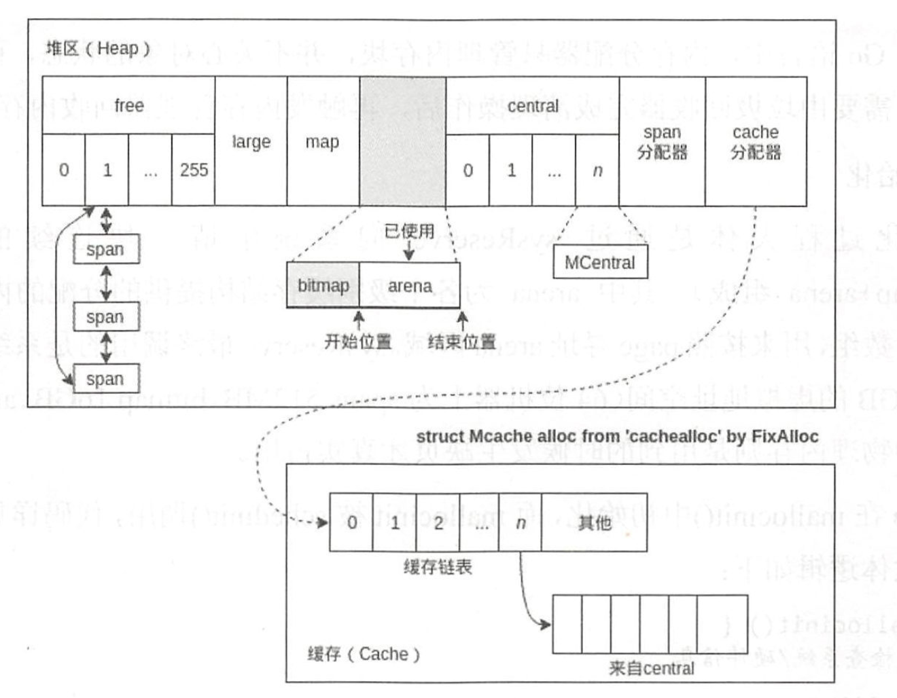

## 一 Go运行时简述

### 1.1 Go Runtime简介

Go语言的内存分配是自主管理的，所以内置了运行时（Runtime），这样能自主实现内存使用模式，如内存池、预分配等。这样的好处是不会让每次内存分配都进行系统调用（会从用户态切换到内核态）。  

Golang的运行时内存分配算法基于TCMalloc算法，即Thread-Caching Malloc，其核心思想是把内存分为多级管理，降低了锁的粒度。在Go中，可用的堆内存采用二级分配的方式进行管理。  

Go中的每个线程都会自行维护一个独立的内存池，进行内存分配是会优先从该内存池中分配，当内存池不足时才会向全局内存池申请，以避免不同线程对全局内存池的频繁竞争。  

### 1.2 内存分配过程

Go程序在启动时会从操作系统申请一大块内存（可以减少系统调用，所以Go在刚启动时占用很大）。实际中，申请到的大块内存并不一定是连续的，Go会将这些零散的内存构建为一个链表，如图所示： 

  

mspan结构体即链表中的节点对象，位于 src/sruntime/mheap.go：
```go
 type mspan struct {
    next            *mspan          // 双向链表下一个节点
    prev            *mspan          // 双向链表前一个节点
    startAddr       uintptr         // 起始序号
    npages          uintptr         // 当前管理的页数
    manualFreeList  gclinkptr       // 待分配的 object 链表
    nelems          uintptr         // 剩余可分配块个数
    allocCount      uint16          // 已分配块个数
 }
```

启动后申请到的内存在Go中会被重新分配虚拟地址空间，在X64上分别是 512MB、16GB、512GB，如图所示：   


图中的三块区域：
- arena：即堆区，Go在这里进行动态内存分配，该区域被分割成了每块8KB大小的页Page，这些页组合成为 mspan
- bitmap：表示页中具体的信息，即arena区哪些地址保存了对象，bitmap使用4bit标志位表示对象是否包含指针、GC标记信息
- spans区域：表示具体页，即mspan指针，每个指针对应一页，spans区域的大小即为：
  - 512GB/8KB：得到arena区域的页数
  - 上述结构*8B：得到spans区域所有指针大小，其值为512MB

源码位于：src/runtime/malloc.go
```go
 _PageShift         = 13
 _PageSize = 1 << _PageShift          // 1左移13 （1后面有13个0） 8KB
```

注意：内存分配器只负责内存块的创建、提取等，其回收动作是由GC清理后触发的，不会主动回收！  

内存分配器会将管理的内存分为两种：
- span：由多个连续的页组成
- object：span会被按照特定大小切分成多个小块，每个小块都可以用于存储对象

具体的分配过程：
- 为对象分配内存时，只需要从链表中取出一个大小合适的节点即可
- 为对象回收内存时，会将对象使用的内存重新插回到链表中
- 如果闲置内存过多，也会尝试归还部分内存给操作系统，降低整体开销


### 1.3 内存分配器的组件

内存分配器包括3个组件：cache、central、heap。

**cache**：  
每个运行期工作线程都会绑定一个cache，用于无锁obeject的分配，在本地缓存可用的mspan资源，这样就可以直接给运行时分配，因为不存在多个go协程竞争的情况，所以不会消耗资源。  

macache结构体位于 src/runtime/mcache.go:
```go
type mcache struct {
    alloc   [numSpanClasses]*mspan      // mspan结构体指针数组，以该值为索引管理多个用于分配的span
}
```

**central**：  
为所有mcache提供切分好的后备span资源，每个central保存一种特定大小的全局mspan列表，包括已经分配出去的和未分配出去的。每个mcentral都会对应一种mspan，根据mspan的种类不同，分割的object大小不同。  

mcentral结构体位于 src/runtime/mcentral.go
```go
type mcentral struct {
    lock        mutex
    sizeclass   int32           // 规格
    nonempty    mSpanList       // 尚有空闲object的mspan链表
    empty       mSpanList       // 无空闲object的mspan链表，或者是已被mcache取走的mspan链表
    nmalloc     uint64          // 已累计分配的对象个数
}
```

sizeclass 规格即内存分配大小的规格，依据不同的规格描述不同mspan。

**heap**：  

管理闲置span，需要时想操作系统申请内存

Go要求尽量复用内存，其复用机制总结如下：
- Go程序启动时，向操作系统申请一大块内存，之后自行管理
- Go内存管理的基本单元是mspan，由若干页组成，每种mspan都可以分配特定大小的object
- mcache、mcentral、mheap是go内存管理的是哪个组件，其关系依次推进
  - mcache：管理线程在本地缓存的mspan
  - mcentral：管理全局的mspan供所有线程使用
  - mheap：管理go所有动态分配的内存
- 一般小对象通过mspan分配内存，大对象直接由mheap分配内存

## 二 Mspan 内存管理器详解

在Go语言中，内存被划分为两部分：
- 堆：供内存分配
- bitmap：管理堆

这两部分的内存都是从同一个地址开始申请的，向高地址的方向增长的就是内存池，向低地址方向增长的就是 bitmap 。  

Go语言的内存管理缓存结构：  

Go 语言为每个系统线程分配了 一个本地 MCache （类似 TCMalloc 中的 ThreadCache，不过 Go 语言改了名称），少量的地址分配就是从 MCache 分配的，并且定期进行垃圾回收，所以 Go 语言的分配器包含了显式与隐式的调用。 Go 语言定义的小块内存与 TCMalloc 基本一致， Go 语言底层会把这些小块内存按照指定规格（和 TCMalloc 的 class 类似）进行切割，整个过程结构都与 TCMalloc 相似。  

Go语言内存分配的主要组件：
- MCache：每个尺寸的 class 都有一个空 闲链表 。 每个 goroutine C 线程〉都有自己的局部 MCache （小对象从它取，无须加锁，没有竞争，因此十分高效）
- MCentral：与 TCMalloc 的 CentralCache 类似， MCache 可以从这里获取更多 内存，当自身无空闲内存时，可以向 MHeap 申请一个 span （只能一个〉，申请的 span 包含多少个 page 由 central 的 sizeclass 确定
- MHeap：负责将 MSpan 组织和管理起来。分配过程和 TCMalloc 类似，从 free 数组中分配，如果发生切割则将剩余的部分放回 free 数组中。回收过程也类似，回
收一个 Mspan 时，先查找它的相邻地址，再通过 map 映射得到对应的 Mspan，如果 Mspan 的状态是未使用，则可以将两者合井 。 最后将这个 page 或者合并后的 page归还到台ee 数组分配池或者 large 中。  

Go的alloc示意图：  

  

` struct Mcache alloc from 'cachealloc' by FixAlloc `意思是newobject是从arena区域分配的，runtime层自身管理的结构如mache等是专门设计了fixAlloc来分配的，这里与TCMalloc不一样！  

## 三 内存分配代码详解

在 Go 语言中，内存分配器只管理内存块，并不关心对象的状态，而且不会主动回收内存，需要由垃圾回收器完成清理操作后，再触发内存管理器回收内存 。  

### 3.1 初始化

初始化过程大体是通过 sysReserve 向系统申请一块连续的内存（由 spans+bitmap+arena 组成）。其中 arena 为各级别缓存结构提供的内存块， spans 是一个指针数组，用来按照 page 寻址 arena 区域。 sysReserve 最终调用的是系统函数 mmap，会申请 512GB 的虚拟地址空间 （ 64 位机器上为 spans 512MB,bitmap 16GB 、 arena 512GB ) ，当然真正的物理内存则是用到的时候发生缺页才真实占用。  

MHeap 在 mallocinit（）中 初始化，而 mallocinit 被 schedinit（）调用，代码详见／src/runtime/proc.go `mallocinit()`。  

MCentral 的初始化比较简单，设置自身级别并将两个 mspanList 初始化 。 而 MCache 在 procresize(nprocs int32) * p 中初始化（代码如下） , procresize 也在 schedinit（）中调用，顺序在 mallocinit（）之后，也就是说发生在 MHeap 与 MCentral 的初始化后面 。代码见 `func p 「oc 「esize(np 「ocs int32) *p`。  

所有的 P 都存放在一个全局数组 allp 中， procresizeO的目的就是将 allp 用到的 P 进行初始化，同时对多余的 P 的资源隔离 。至此， 管理结构 h征leap 、 MCentral 及每个 P 的 MCache 都初始化完毕，接下来进入分配阶段。  

### 3.2 分配

分配的整个流程是：将小对象所需 内存大小向上取整到最近的尺寸类别或者称为规格( class ），查找相应 的 MCache 的 空 闲 链表， 如 果链表不空，直接从上面分配一个对象，这个过程不加锁；如果 MCache 空闲链表是空的，通过 MCentral 的空闲链表取一些对象进行补充：如果 MCentral 的空闲链表也是空的， 则在 h哑leap 中取用一些 page 对 MCentral 进行补充，然后将这些内存分割成特定规格：如果 MHeap 没有足够大的 page 时，从操作系统分配一组新的 page 。  

为了避免逃逸的情况，假设关闭了内联优化，现在来看源码，当 时W 一个对象时，调用的是 newobject（）， 但实际上调用的是 mallocgc()


对于小于 16B 的内存块， Mcache 有一个专门的内存区域“ tiny”用来分配， tiny 指针指向 tiny 内存块的起始地址 。 如上所示， tinyoffset 表示 tiny 当前分配的地址位置，之后的分配根据 tinyoffset 寻址 。 先根据要分配的对象大小进行地址对齐， 比如 size 是 8 的倍数， tinyoffset 就和 8 对齐 ，然后进行分配 。 如果 tiny 剩余 的 空 间不够用，则重新 申 请一个 16B 的内存块， 并分配给 object 。 如果有余，则记录在 tiny 上。

对于大于 32阻的内存分配，直接跳过 mcache 和 mcentral，通过 mheap 分配。大于 32KB 的内存分配都是分配整数页，先右移然后低位与计算需要的页数。详见`func largeAlloc(size uintptr， needzero bool) *mspan` 

最后是对于大小介于 16KB～ 32KB的小对 象内存分配，首先计算应该分配的sizeclass ，然后去 mcache 里面申请，如果不够，就让 mcache 向 mcentral 申请再分配 。 Mcentral为 mcache 分配完之后会判断自己需不需要扩充，如果需要就向 mheap 申请 。源码位于 `sizeclass`部分。  

### 3.3 回收释放

这里的回收并非是垃圾回收，而是更简单的内存回收。MSpan 里有 sweepgen 回收标记，回收的内存会先全部回到 MCentral,如果己经回收所有的 MSpan，就还给 MHeap 的空闲列表 。 回收内存的一个很重要的原因是为了复用，所以很多时候并不会直接释放内存。  

对于MCache，使用内存时有两种情况：第一种是用完了闲置，第二种是用了但没用完，前者直接标记等待回收就可以，至于多出来没用到的部分就需要另外想办法还给
MCentral，代码见 `func freemcache(c *mcache) `和 `func (c * mcache ）releaseAll()`，以及标记回收`func (s *mspan) sweep(preserve bool) bool`。  

源码中sysmon 是监控线程，它会遍历 MHeap 中 large 列表里 的所有空闲的 MSpan ， 发现空闲时间超过阔值就调用 madvise，让系统内核释放这个线程相关的物理内存 。  

经过上面的步骤 ， MCache 的空闲 MSpan 己经还给 MCentral 了， 接下来就是 MCentral还给 MHeap 了，这个过程简单来说是当 MSpan 的 object 全部收回时，将 MSpan 归还给Mheap，代码见`func (c * mcentral）freeSpan(s *mspan, preserve bool, wasempty bool) bool`。  

到了最后， MHeap 那里并不会定时向操作系统归还内存，而是先把相邻的 span 合井，使之成为一块更大的内存，以 page 为单位调度回收。
