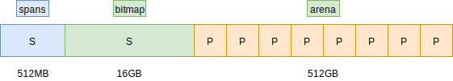

## 一 Go运行时

### 1.1 Go Runtime简介

Go语言的内存分配是自主管理的，所以内置了运行时（Runtime），这样能自主实现内存使用模式，如内存池、预分配等。这样的好处是不会让每次内存分配都进行系统调用（会从用户态切换到内核态）。  

Golang的运行时内存分配算法基于TCMalloc算法，即Thread-Caching Malloc，其核心思想是把内存分为多级管理，降低了锁的粒度。在Go中，可用的堆内存采用二级分配的方式进行管理。  

Go中的每个线程都会自行维护一个独立的内存池，进行内存分配是会优先从该内存池中分配，当内存池不足时才会向全局内存池申请，以避免不同线程对全局内存池的频繁竞争。  

### 1.2 内存分配过程

Go程序在启动时会从操作系统申请一大块内存（可以减少系统调用，所以Go在刚启动时占用很大）。实际中，申请到的大块内存并不一定是连续的，Go会将这些零散的内存构建为一个链表，如图所示： 

  

mspan结构体即链表中的节点对象，位于 src/sruntime/mheap.go：
```go
 type mspan struct {
    next            *mspan          // 双向链表下一个节点
    prev            *mspan          // 双向链表前一个节点
    startAddr       uintptr         // 起始序号
    npages          uintptr         // 当前管理的页数
    manualFreeList  gclinkptr       // 待分配的 object 链表
    nelems          uintptr         // 剩余可分配块个数
    allocCount      uint16          // 已分配块个数
 }
```

启动后申请到的内存在Go中会被重新分配虚拟地址空间，在X64上分别是 512MB、16GB、512GB，如图所示：   


图中的三块区域：
- arena：即堆区，Go在这里进行动态内存分配，该区域被分割成了每块8KB大小的页Page，这些页组合成为 mspan
- bitmap：表示页中具体的信息，即arena区哪些地址保存了对象，bitmap使用4bit标志位表示对象是否包含指针、GC标记信息
- spans区域：表示具体页，即mspan指针，每个指针对应一页，spans区域的大小即为：
  - 512GB/8KB：得到arena区域的页数
  - 上述结构*8B：得到spans区域所有指针大小，其值为512MB

源码位于：src/runtime/malloc.go
```go
 _PageShift         = 13
 _PageSize = 1 << _PageShift          // 1左移13 （1后面有13个0） 8KB
```

注意：内存分配器只负责内存块的创建、提取等，其回收动作是由GC清理后触发的，不会主动回收！  

内存分配器会将管理的内存分为两种：
- span：由多个连续的页组成
- object：span会被按照特定大小切分成多个小块，每个小块都可以用于存储对象

具体的分配过程：
- 为对象分配内存时，只需要从链表中取出一个大小合适的节点即可
- 为对象回收内存时，会将对象使用的内存重新插回到链表中
- 如果闲置内存过多，也会尝试归还部分内存给操作系统，降低整体开销


### 1.3 内存分配器的组件

内存分配器包括3个组件：cache、central、heap。

**cache**：  
每个运行期工作线程都会绑定一个cache，用于无锁obeject的分配，在本地缓存可用的mspan资源，这样就可以直接给运行时分配，因为不存在多个go协程竞争的情况，所以不会消耗资源。  

macache结构体位于 src/runtime/mcache.go:
```go
type mcache struct {
    alloc   [numSpanClasses]*mspan      // mspan结构体指针数组，以该值为索引管理多个用于分配的span
}
```

**central**：  
为所有mcache提供切分好的后备span资源，每个central保存一种特定大小的全局mspan列表，包括已经分配出去的和未分配出去的。每个mcentral都会对应一种mspan，根据mspan的种类不同，分割的object大小不同。  

mcentral结构体位于 src/runtime/mcentral.go
```go
type mcentral struct {
    lock        mutex
    sizeclass   int32           // 规格
    nonempty    mSpanList       // 尚有空闲object的mspan链表
    empty       mSpanList       // 无空闲object的mspan链表，或者是已被mcache取走的mspan链表
    nmalloc     uint64          // 已累计分配的对象个数
}
```

sizeclass 规格即内存分配大小的规格，依据不同的规格描述不同mspan。

**heap**：  

管理闲置span，需要时想操作系统申请内存

Go要求尽量复用内存，其复用机制总结如下：
- Go程序启动时，向操作系统申请一大块内存，之后自行管理
- Go内存管理的基本单元是mspan，由若干页组成，每种mspan都可以分配特定大小的object
- mcache、mcentral、mheap是go内存管理的是哪个组件，其关系依次推进
  - mcache：管理线程在本地缓存的mspan
  - mcentral：管理全局的mspan供所有线程使用
  - mheap：管理go所有动态分配的内存
- 一般小对象通过mspan分配内存，大对象直接由mheap分配内存

