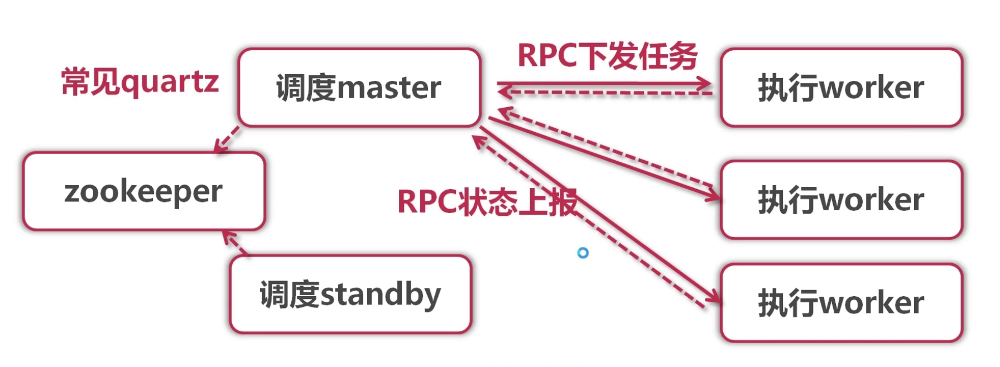
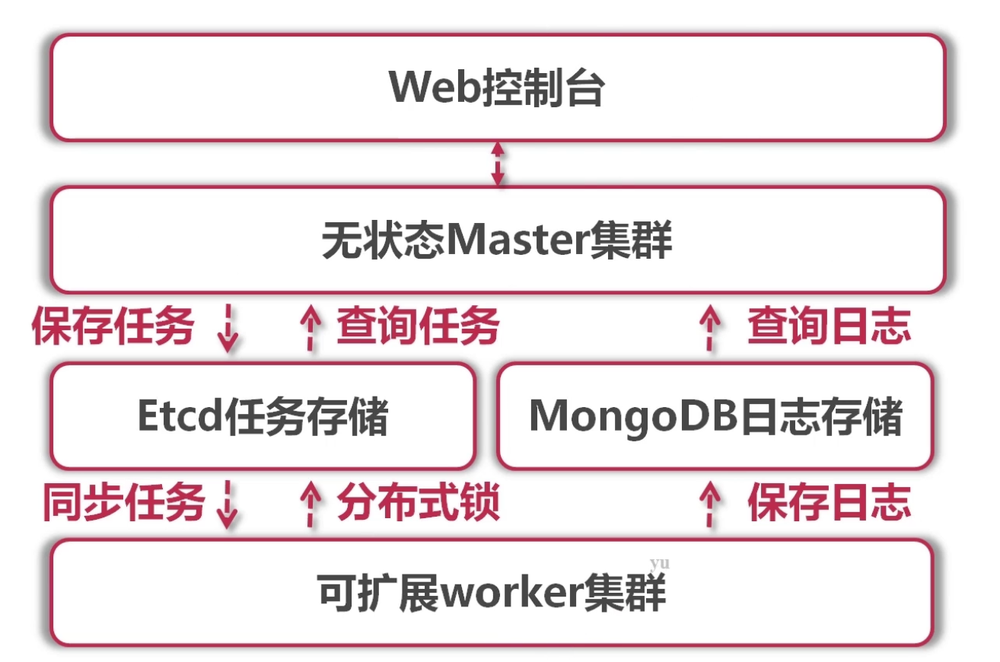
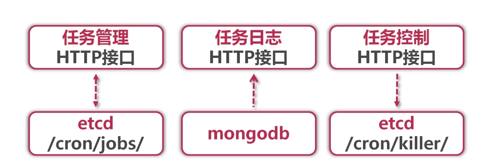
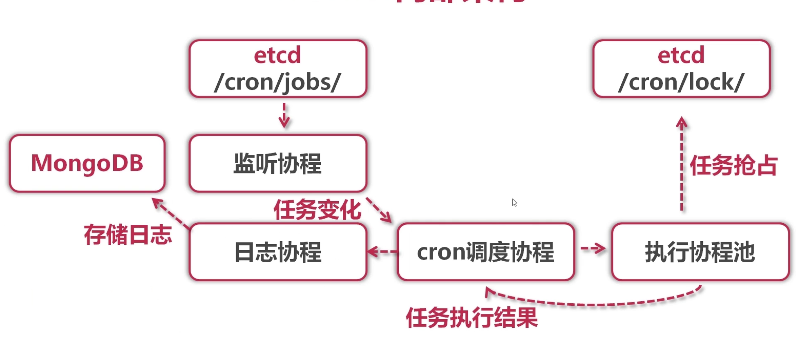

## 一 任务调度概述

#### 1.1 业务场景

- 支付系统每天凌晨1点跑批，进行一天清算，每月1号进行上个月清算
- 电商整点抢购，商品价格8点整开始优惠
- 12306购票系统，超过30分钟没有成功支付订单的，进行回收处理
- 商品成功发货后，需要向客户发送短信提醒

#### 1.2 为什么需要定时任务

很多业务场景需要我们某一特定的时刻去做某件任务，定时任务解决的就是这种业务场景。一般来说，系统可以使用消息传递代替部分定时任务，两者有很多相似之处，可以相互替换场景。如，上面发货成功发短信通知客户的业务场景，我们可以在发货成功后发送MQ消息到队列，然后去消费mq消息，发送短信。
但在某些场景下不能互换：  
- 时间驱动/事件驱动：内部系统一般可以通过时间来驱动，但涉及到外部系统，则只能使用时间驱动。如怕取外部网站价格，每小时爬一次
- 批量处理/逐条处理：批量处理堆积的数据更加高效，在不需要实时性的情况下比消息中间件更有优势。而且有的业务逻辑只能批量处理。如移动每个月结算我们的话费
- 实时性/非实时性：消息中间件能够做到实时处理数据，但是有些情况下并不需要实时，比如：vip升级
- 系统内部/系统解耦：定时任务调度一般是在系统内部，而消息中间件可用于两个系统间

## 二 任务调度架构简介

#### 2.1 整体架构

传统单机任务调度缺陷:
- 单机故障后，任务调度直接停止
- 任务数量达到上限后，需要人工迁移

分布式架构：
- 调度器：一个高可用的调度器，确保不会因为单点故障停止调度
- 扩展性：需要提供可扩展性，以提供大量任务的并行处理能力  

常见的分布式架构-java版：  



如图所示，拥有master调度器和备份调度器standby，由zookeeper利用quartz框架调度。  

在分布式系统中，永远不可能对节点之间的信息传输信任，所以会出现下列问题：
- RPC因为网络原因出现问题
- Master下发任务异常，导致Master与Worker状态不一致
  - 比如master下发给node1出现异常，但是workder其实收到了并开始执行，此时master会重试下发任务给node2，结果node2与node1同时执行了一个任务
  - 比如master更新zookeeper异常，master宕机切换到standby，任务仍旧处于旧状态
- Worker上报任务异常，导致Master状态信息落后

更好的任务调度架构思路：
- 利用etcd等框架同步全量任务列表到worker节点（不会产生性能问题：千万级排序也只有1.5秒不到）
- 每个worker独立调度全量任务，无需与master产生直接RPC
- 由于woerk都在调度全量任务，会产生分布式锁抢占，需要解决并发调度相同任务的问题

整体架构图：  
  

#### 2.2 master功能

Master功能：
- 任务管理HTTP接口：对任务的增删改查
- 任务日志HTTP接口：查看任务执行历史日志
- 任务控制HTTP接口：强制结束任务接口
- web管理界面：vue实现的前后端分离控制台

Master内部架构：  
  

Etcd结构：
```
/cron/jobs/任务名 -> {
    name,               // 任务名
    command,            // shell命令
    cronExpr            // cron表达式
}
```

任务日志在mongodb中的结构
```
{
    jobName,
    command,
    err,
    output,
    startTime,
    endTime
}
```

 master将要结束的任务名put在/cron/killer/，触发worker结束shell任务，worker会监听/cron/killer/目录下的put修改操作，来执行任务杀死操作   

#### 2.3 worker功能

worker功能包括：
- 任务同步：监听etcd中/cron/jobs/目录变化
- 任务调度：基于cron表达式计算，触发过期任务
- 任务执行：协程池触发并执行多任务，基于etcd分布式锁抢占
- 日志保存：捕获任务执行输出，保存到MongoDB

worker内部架构：  

  

调度协程：
- 监听任务变更事件，更新内存中维护的任务列表
- 检查任务cron表达式，扫描到期任务，交给执行协程运行
- 监听任务控制event，强制中断正在执行中的子进程
- 监听任务执行result，更新内存中任务状态，投递执行日志


