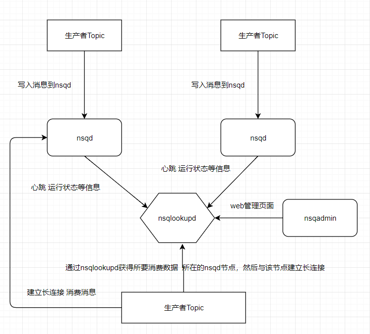

## 一 nsq消息队列介绍

NSQ是Go语言开发的开源分布式消息队列中间件，由于基于内存，可以大规模处理每天数以十亿级别的消息。  

NSQ具备分布式和去中心化特点，没有单点故障。  

NSQ应用场景（也是消息队列的应用场景）：
- 异步处理：把非关键流程异步化，提高系统的响应时间和健壮性。比如用户注册城后发送邮件的任务不是核心功能，可以进行异步处理，该任务写入消息队列即可。后台会有一个进程不断的监听是否有新的消息，当有新的消息则执行。
- 应用解耦：比如订单系统内的每个订单都要同步到另外一个系统库存系统中，以前的时候只要库存系统为订单系统开发一个接口即可，如果现在有第三个系统也依赖订单系统，这时订单系统也要对接第三个系统的接口，如此一来，三个系统之间就耦合了。我们可以将订单加入消息队列，其他的系统订阅该消息队列即可，再多的新系统加入也不会和订单系统本身有关了。
- 流量削峰：比如促销活动开启时，会在活动期间造成短暂的流量压力，那么只要将该活动加入消息队列，即可达到流量削峰目的。

## 二 nsql架构

NSQL的组件：
- nsqd：负责消息接收，保存以及发送消息给消费者的进程
- nsqlookupd：负责维护所有的nsqd的状态，提供服务发现的进程
- nsqadmin：是一个web管理平台，实时监控集群状以及执行各种管理任务

架构如图：


这样架构的好处：nsqd之间互不影响，可以无缝的增加nsqd节点，同时nsqlookupd也可以部署两台，以防止单点故障。  

名词解释：
- Topic：对应一个具体的队列，比如订单数据放到order_queue这个topic
- Channel：每个消费者对应一个channel，实现消息可重复消费，比如A系统会消费一个订单数据，消费完毕，该订单消息就不见了，B系统就拿不到订单消息了，nsql为A系统和B系统都创建一个channel，新的订单消息会分别往A和B的channel中各复制一份。

注意：
- nsq消息默认不支持持久化，可以配置成持久化
- 每条消息至少传递一次
- 消息不保证顺序

## 三 nsq的使用

https://nsq.io/overview/quick_start.html  

写入消息客户端：go get github.com/nsqio/go-nsq  

生产者示例代码：
```go
package main

import (
	"bufio"
	"fmt"
	"os"
	"strings"
)

var producer *nsq.Producer

func initProducer(nsqAddress string) error {
	var err error
	config := nsq.NewConfig()
	producer, err = nsq.NewProducer(nsqAddress, config)

	if err != nil {
		return err
	}

	return nil
}

func main() {

	nsqAddress := "127.0.0.1:4150"
	err := initProducer(nsqAddress)
	if err != nil {
		fmt.Printf("init producer failed,err:%v\n", err)
		return
	}

	//业务逻辑：这里示例读取控制台读取一段输入
	reader := bufio.NewReader(os.Stdin)
	for {

		data, err := reader.ReadString('\n')
		if err != nil {
			fmt.Printf("read string failed, err:%v\n", err)
			continue
		}

		data = strings.TrimSpace(data)
		if data == "stop" {
			break
		}

		err = producer.Publish("order queue", []byte(data))
		if err != nil {
			fmt.Printf("publish msg failed, err:%v\n", err)
			continue
		}
		fmt.Printf("publish dataL:%s succ \n", data)
	}

}
```

消费者：https://blog.csdn.net/sd653159/article/details/83624661